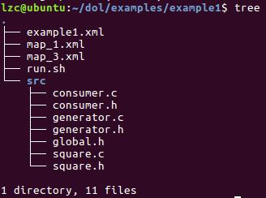
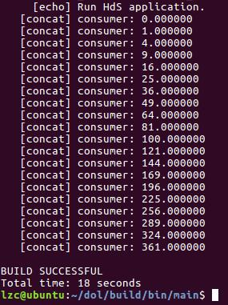
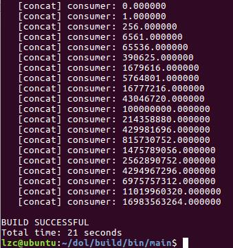
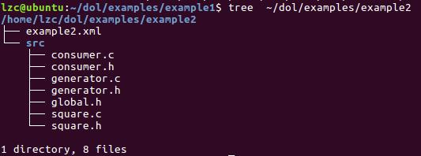
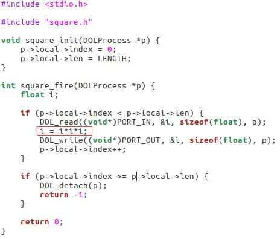
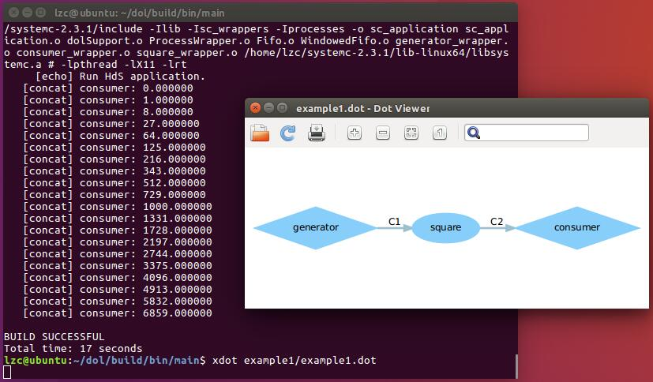

<!-- TOC -->

- [Lab 3 - DOL实例分析&编程](#lab-3---dol实例分析编程)
    - [example1分析](#example1分析)
    - [example2分析](#example2分析)
    - [实验任务](#实验任务)
        - [任务一：修改example2，让3个square模块变成2个](#任务一修改example2让3个square模块变成2个)
        - [任务二：修改example1，使其输出3次方数](#任务二修改example1使其输出3次方数)
        - [任务三：结合论文分析编译过程](#任务三结合论文分析编译过程)
- [附录](#附录)
    - [参考资料](#参考资料)
    - [额外收获](#额外收获)

<!-- /TOC -->
# Lab 3 - DOL实例分析&编程

接着上次实验的内容，这次实验分析上一次实验生成的example文件夹的内容。相关路径为：```~/dol/examples```。

## example1分析

以example1为例，该文件夹下有如下文件和文件夹：



先来看看example1.xml：

```xml
<?xml version="1.0" encoding="UTF-8"?>
<processnetwork 
xmlns="http://www.tik.ee.ethz.ch/~shapes/schema/PROCESSNETWORK" 
xmlns:xsi="http://www.w3.org/2001/XMLSchema-instance" 
xsi:schemaLocation="http://www.tik.ee.ethz.ch/~shapes/schema/PROCESSNETWORK
    http://www.tik.ee.ethz.ch/~shapes/schema/processnetwork.xsd" name="example1"> 

  <!-- processes -->
  <process name="generator"> 
    <port type="output" name="1"/>
    <source type="c" location="generator.c"/>
  </process>

  <process name="consumer"> 
    <port type="input" name="1"/> 
    <source type="c" location="consumer.c"/>
  </process>

  <process name="square"> 
    <port type="input" name="1"/>
    <port type="output" name="2"/>
    <source type="c" location="square.c"/>
  </process>

  <!-- sw_channels -->
  <sw_channel type="fifo" size="10" name="C1">
    <port type="input" name="0"/>
    <port type="output" name="1"/>
  </sw_channel>

  <sw_channel type="fifo" size="10" name="C2">
    <port type="input" name="0"/>
    <port type="output" name="1"/>
  </sw_channel>

  <!-- connections -->
  <connection name="g-c">
    <origin name="generator">
      <port name="1"/>
    </origin>
    <target name="C1">
      <port name="0"/>
    </target>
  </connection>

  <connection name="c-c">
    <origin name="C2">
      <port name="1"/>
    </origin>
    <target name="consumer">
      <port name="1"/>
    </target>
  </connection>

  <connection name="s-c">
    <origin name="square">
      <port name="2"/>
    </origin>
    <target name="C2">
      <port name="0"/>
    </target>
  </connection>

  <connection name="c-s">
    <origin name="C1">
      <port name="1"/>
    </origin>
    <target name="square">
      <port name="1"/>
    </target>
  </connection>

</processnetwork>
```

注：
- port中的name的值为整数，代表端口的编号，在相关的.h文件中有定义
- sw_channels中size代表缓冲区大小，name代表线的名字
- 每条线要有**2**个connection，从origin到target，name为线的名字（这个无关紧要）

对应下图，该文件提供系统架构（即**模块连接方式**）的定义，process对应**框**, sw_channel对应**线**（即通道定义）, connection对应**各个模块之间的连接**。


在这里，generator对应生产者，square对应处理模块，consumer对应x消费者。

src文件夹内包含各进程（生产者，消费者，处理模块等）的功能定义，有.c和.h这两种文件，对应实现的模块，即是.dot文件中的框框的功能描述。每个模块要实现2个接口，xxx_init 和 xxx_fire两个函数，分别是初始化这个模块是干了什么，以及这个模块开始干的时候做什么。

接着来看generator.h和generator.c这两个文件：

```c
#ifndef GENERATOR_H
#define GENERATOR_H

#include <dol.h>
#include "global.h"

#define  PORT_OUT 1

typedef struct _local_states {
    int index;
    int len;
} Generator_State;

void generator_init(DOLProcess *);
int generator_fire(DOLProcess *);

#endif
```

```c
#include <stdio.h>
#include <string.h>

#include "generator.h"

// initialization function
void generator_init(DOLProcess *p) {
    p->local->index = 0;
    p->local->len = LENGTH;
}

int generator_fire(DOLProcess *p) {

    if (p->local->index < p->local->len) {
        float x = (float)p->local->index;
        //将x写到generator的端口“PORT_OUT”上
        DOL_write((void*)PORT_OUT, &(x), sizeof(float), p);
        p->local->index++;
    }

    if (p->local->index >= p->local->len) {
        DOL_detach(p);//销毁
        return -1;
    }

    return 0;
}
/*
注：DOL_write和DOL_detach都是DOL提供的APL接口。
*/
```

每个模块都要写上xxx_fire，其可能被执行无数次，至于xxx_init是可选择写或者不写的，其只会被执行一次（进行初始化操作）。

代码分析：

- generator_init：初始化函数，将当前位置置为0，设置生产者长度。这里的local指针指向的是.h文件的_local_states结构。

- generator_fire：信号产生函数，如果当前位置小于生产长度，则将x（这里是当前下标）写入到输出端，否则销毁进程。所以就是说，让这个程序被发射、开火、执行length次之后停下来。

再来看看consumer.h和consumer.c这两个文件：

```c
#ifndef CONSUMER_H
#define CONSUMER_H

#include <dol.h>
#include "global.h"

#define PORT_IN 1

typedef struct _local_states {
    char name[10];
    int index;
    int len;
} Consumer_State;

void consumer_init(DOLProcess *);
int consumer_fire(DOLProcess *);

#endif
```

```c
#include <stdio.h>

#include "consumer.h"

void consumer_init(DOLProcess *p) {
    sprintf(p->local->name, “consumer”); //就是p->local->name==“consumer”
    p->local->index = 0;
    p->local->len = LENGTH;
}
int consumer_fire(DOLProcess *p) {
    float c;
    if (p->local->index < p->local->len) {
        DOL_read((void*)PORT_IN, &c, sizeof(float), p);//读consumer的端口“PORT_IN”
        printf(“%s: %f\n”, p->local->name, c); //将结构输出到命令行
        p->local->index++;
    }
    if (p->local->index >= p->local->len) {
        DOL_detach(p);
        return -1;
    }
    return 0;
}
```

代码分析：

- consumer_init：初始化函数，含义同generator_init。
- consumer_fire：信号消费函数，若当前位置小于设定长度，则读出输入端信号，并且打印；否则销毁进程（停下来）。

再来看看square.c：

```c
int square_fire(DOLProcess *p) {
    float i;
    if (p->local->index < p->local->len) {
        //读square的端口“PORT_IN”,将值读到i
        DOL_read((void*)PORT_IN, &i, sizeof(float), p); 
        i = i*i;     //进行平方运算
        //写square的端口“PORT_OUT”,把 I 写到那个端口
        DOL_write((void*)PORT_OUT, &i, sizeof(float), p); 
        p->local->index++;
    }
    if (p->local->index >= p->local->len) {
        DOL_detach(p);
        return -1;
    }
    return 0;
}

```

该函数为信号处理函数，其读入输入端信号i，将其平方后写出到输出端，重复length次后停止。

简单地说，example1所做的事就是：由generator产生0-19的整数（length为20，初始值为0），square对这些数进行平方操作，最后由consumer输出结果。其运行结果如下：



## example2分析

首先输入如下命令运行example2：

```r
cd dol/build/bin/main
sudo ant -f runexample.xml -Dnumber=2
```

运行结果如下：



运行如下命令查看.dot文件：

```
cd example2
xdot example2.dot
```

可得结果：


比较该图与example1的结果，貌似两者有一些相似之处。下面来比较两个example的源码的不同之处。

首先，可看出example2下的文件结构如下：



可见src中的文件命名和example1的完全一样。

接着比较两者的src文件夹：```diff ~/dol/examples/example1/src ~/dol/examples/example2/src```


可以看到，除了端口号的定义不一样之外，函数的实现是和example1一样的，因此框框图中的process的功能是和example1一样的。

接着来比较example1.xml和example2.xml：```diff ~/dol/examples/example1/example1.xml ~/dol/examples/example2/example1.xml```

输出结果有些长，所以两个example的区别应该是这两个xml文件的区别，打开example2.xml后如下：

```xml
<?xml version="1.0" encoding="UTF-8"?>
<processnetwork xmlns="http://www.tik.ee.ethz.ch/~shapes/schema/PROCESSNETWORK" xmlns:xsi="http://www.w3.org/2001/XMLSchema-instance" xsi:schemaLocation="http://www.tik.ee.ethz.ch/~shapes/schema/PROCESSNETWORK
http://www.tik.ee.ethz.ch/~shapes/schema/processnetwork.xsd" name="example2"> 

  <variable value="3" name="N"/>

  <!-- instantiate resources -->
  <process name="generator">
    <port type="output" name="10"/>
    <source type="c" location="generator.c"/>
  </process>

  <iterator variable="i" range="N">
    <process name="square">
      <append function="i"/>
      <port type="input" name="0"/>
      <port type="output" name="1"/>
      <source type="c" location="square.c"/>
    </process>
  </iterator>

  <process name="consumer">
    <port type="input" name="100"/>
    <source type="c" location="consumer.c"/>
  </process>

  <iterator variable="i" range="N + 1">
    <sw_channel type="fifo" size="10" name="C2">
      <append function="i"/>
      <port type="input" name="0"/>
      <port type="output" name="1"/>
    </sw_channel>
  </iterator>

  <!-- instantiate connection -->
  <iterator variable="i" range="N">
    <connection name="to_square">
      <append function="i"/>
      <origin name="C2">
        <append function="i"/>
        <port name="1"/>
      </origin>
      <target name="square">
        <append function="i"/>
        <port name="0"/>
      </target>
    </connection>

    <connection name="from_square">
        <append function="i"/>
        <origin name="square">
          <append function="i"/>
          <port name="1"/>
        </origin>
        <target name="C2">
          <append function="i + 1"/>
          <port name="0"/>
        </target>
    </connection>
  </iterator>

  <connection name="g_">
    <origin name="generator">
     <port name="10"/>
    </origin>
    <target name="C2"> 
      <append function="0"/>
      <port name="0"/>
    </target>
  </connection>

  <connection name="_c">
    <origin name="C2">
      <append function="N"/>
      <port name="1"/>
    </origin>
    <target name="consumer">
      <port name="100"/>
    </target>
  </connection>

</processnetwork>
```

可以看到和example1的主要的区别就是：通过迭代器（iterator）定义了3个square模块。这里在.dot文件中也可以体现得出来。

因此，总的来说，example2所做的事就是：由generator产生0-19的整数（length为20，初始值为0），用3个square对这些数依次进行平方操作（所以总的效果是对这些数进行了8次方的操作），最后由consumer输出结果。

## 实验任务

### 任务一：修改example2，让3个square模块变成2个

在example2的分析中，可以发现，3个square模块是根据迭代器（iterator）来生成的。而迭代次数N真是由如下代码声明的：

```xml
<variable value="3" name="N"/>
```

那么我们只需要将这行代码改为如下形式即可：

```xml
<variable value="2" name="N"/>
```

接着运行如下命令重新编译运行这个example：

```r
cd dol/build/bin/main
sudo rm -rf example2
sudo ant -f runexample.xml -Dnumber=2
xdot example2/example2.dot
```

运行结果如下，可见输出数据就是输入数据的4次方（2个square），符合预期。

**注意：如果这里没有运行```sudo rm -rf example2```来删除原有的example文件夹，那么修改的代码是不会生效的。**


### 任务二：修改example1，使其输出3次方数

首先，修改square.c这个文件，将红色区域的代码改为图中所示的代码：



接着运行如下命令重新编译运行这个example：

```r
cd dol/build/bin/main
sudo rm -rf example1
sudo ant -f runexample.xml -Dnumber=1
xdot example1/example1.dot
```

运行结果如下，可见输出数据就是输入数据的3次方，符合预期。



### 任务三：结合论文分析编译过程

TODO

# 附录

## 参考资料

1.[linux下tree命令详解][1]
2.[Linux文件夹文件创建、删除][2]


[1]:http://www.cnblogs.com/leijiangtao/archive/2014/06/08/3776280.html
[2]:http://www.cnblogs.com/end/archive/2012/06/05/2536835.html

## 额外收获

刚开始想从虚拟机复制代码到主机来写这篇总结，但是vmware-tool好像出了点问题（这家伙老是这样...），随后便找到了如下两个网站来共享代码：

- http://paste.ubuntu.com
- http://pasted.co

本来第一个网站已经可以满足需求了，但是它却不支持XML代码的分享，随后便找到了第二个网站。


