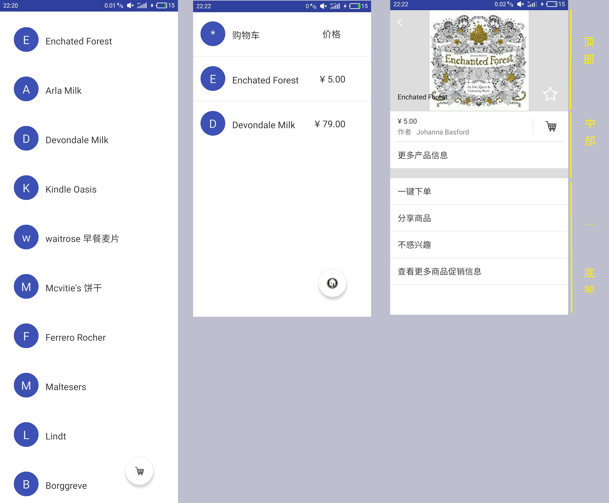
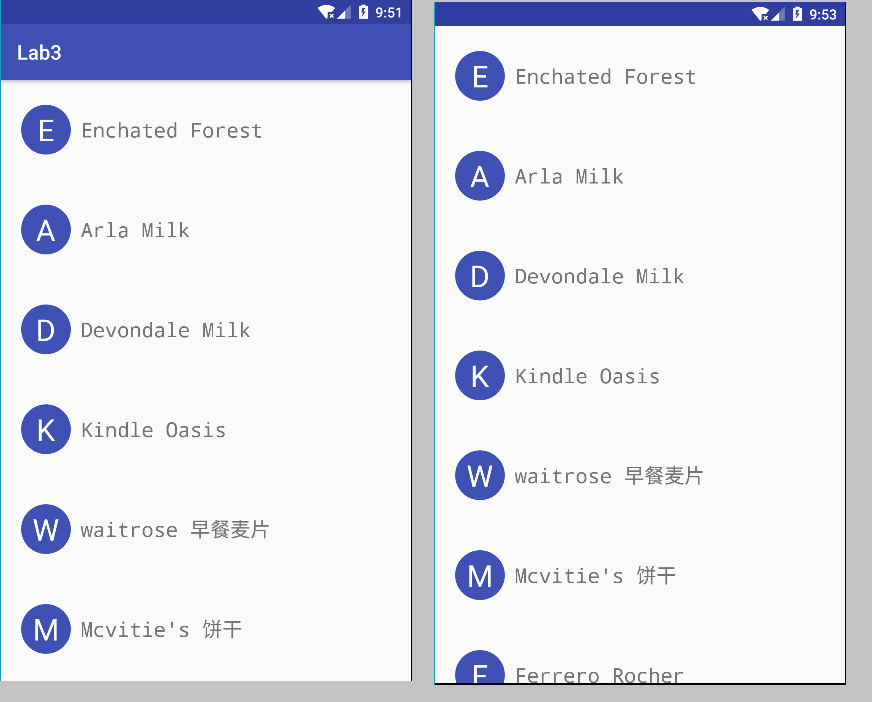
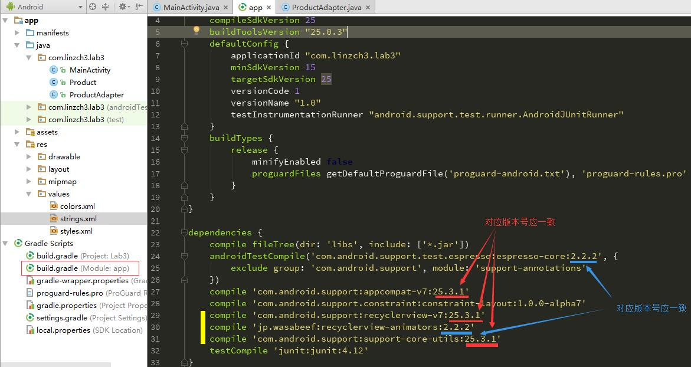
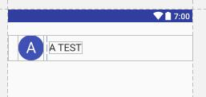
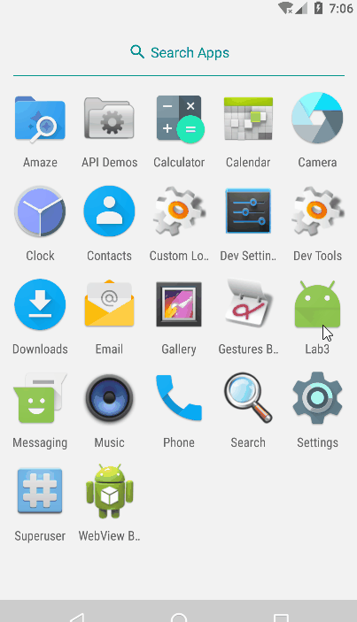
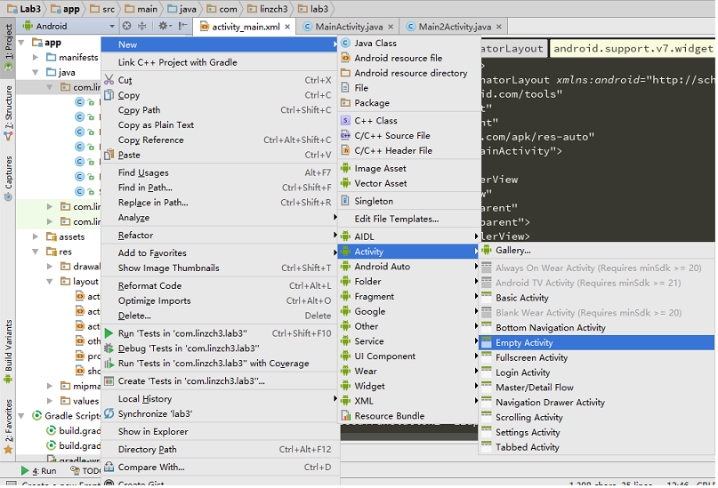
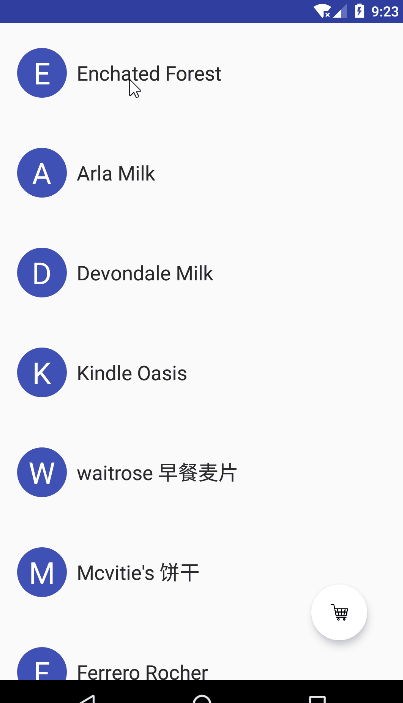
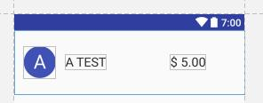
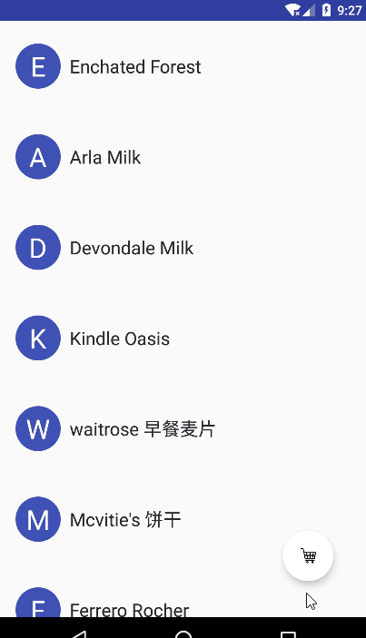

<!-- TOC -->

- [Lab 3 - 实现模拟商品列表](#lab-3---实现模拟商品列表)
    - [实验目的](#实验目的)
    - [实验内容](#实验内容)
    - [实现要求](#实现要求)
        - [布局方面](#布局方面)
        - [逻辑方面](#逻辑方面)
    - [实验步骤](#实验步骤)
        - [step0:总体实现思路](#step0总体实现思路)
        - [step1:去除界面标题栏](#step1去除界面标题栏)
            - [实现效果](#实现效果)
        - [step2:实现商品列表](#step2实现商品列表)
            - [添加依赖](#添加依赖)
            - [RecyclerView介绍](#recyclerview介绍)
            - [编写布局文件](#编写布局文件)
            - [Product类实现](#product类实现)
            - [ProductAdapter类实现](#productadapter类实现)
            - [商品列表显示实现](#商品列表显示实现)
            - [实现效果](#实现效果-1)
        - [step3:实现商品详细内容界面](#step3实现商品详细内容界面)
            - [编写布局文件](#编写布局文件-1)
            - [ProductDetail类实现](#productdetail类实现)
            - [得到布局元素对应的对象](#得到布局元素对应的对象)
            - [商品详细信息存储与读取功能实现](#商品详细信息存储与读取功能实现)
            - [返回按钮功能实现](#返回按钮功能实现)
            - [收藏按钮功能实现](#收藏按钮功能实现)
            - [加入购物车功能实现](#加入购物车功能实现)
            - [界面下方的列表实现](#界面下方的列表实现)
            - [实现效果](#实现效果-2)
        - [step4:购物车内容界面实现](#step4购物车内容界面实现)
            - [编写布局文件](#编写布局文件-2)
            - [列表显示实现](#列表显示实现)
            - [列表点击事件监听实现](#列表点击事件监听实现)
            - [列表长按事件监听实现](#列表长按事件监听实现)
            - [本地广播接收数据实现](#本地广播接收数据实现)
            - [实现效果](#实现效果-3)
        - [step5:悬浮动作按钮实现](#step5悬浮动作按钮实现)
            - [编写布局文件](#编写布局文件-3)
            - [代码实现](#代码实现)
            - [实现效果](#实现效果-4)
    - [遇到的问题以及解决方案](#遇到的问题以及解决方案)

<!-- /TOC -->

# Lab 3 - 实现模拟商品列表

## 实验目的

- 1.复习事件处理
- 2.学习Intent、Bundle在Activity跳转中的应用
- 3.学习RecyclerView、ListView以各类适配器的用法

## 实验内容

本次实验模拟实现一些商品表，有两个界面，第一个界面用于呈现商品（如下左图，为长截屏），点击右下方的悬浮的按钮可切换到购物车（如下中图）；点击第一个界面中的列表的任一项，可看到商品的详细信息（如下右图）。



## 实现要求

### 布局方面

- 1.商品列表界面
    - [x] 每一项为一个圆圈和一个名字，圆圈与名字均竖直居中。
    - [x] 圆圈中为名字的首字母，首字母要处于圆圈的中心，首字母为白色，名字为黑色，圆圈的颜色可自定义（尽量选择深色）。
- 2.购物车列表界面
    - [x] 在商品表界面的基础上增加一个价格，价格为黑色。
- 3.商品详情界面
    - 顶部
        - [x] 顶部占整个界面的1/3。
        - [x] 每个商品的图片在商品数据中已给出，图片与当前view等高。
        - [x] 返回图标（即是“<”）处于当前view左上角。
        - [x] 商品名字处于左下角。
        - [x] 返回图标与商品名字左对齐。
        - [x] 星标位于右下角。
        - [x] 商品名字和星标底边对齐。
        - [x] 返回图标、商品、星标与边距都有一定距离，自己调出合适的距离即可。
        - [x] 该部分推荐用RelativeLayout实现。
    - 中部
        - [x] 黑色字体（比如价格和“更多产品信息”）的argb编码值为#D5000000，字体大小可自行调节，和给出的例子差不多就好了
        - [x] 价格下面的偏灰色的字体的argb编码值为#8A000000。
        - [x] 价格下面的分割线和购物车图标左侧的分割线的argb编码值为#1E000000。
        - [x] 购物车图标左侧分割线要求高度与购物车图像高度一致，并且竖直居中。
        - [x] “更多产品信息”底部的分隔区域高度也可自行调节，argb编码值为#1E000000。
    - 底部
        - [x] 按图照葫芦画瓢即可。
- 4.【特别提醒】
    - [x] 这次的界面顶部都没有标题栏，需要用某些方法把它们去掉。

### 逻辑方面

- 1.商品列表界面
    - [x] 使用RecyclerView实现商品列表。
    - [x] 点击商品列表中的某一个商品会跳转到该商品详情界面。
    - [x] 长按商品列表中的第i个商品会删除该商品，并且弹出Toast提示“移除第i个商品”。（i从0开始）
- 2.点击右下方的FloatingActionButton，从商品列表切换到购物车或从购物车切换到商品列表，并且其里面的图标要做相应的变化。
    - [x] 可通过设置RecyclerView不可见+ListView可见来实现从商品列表切换到购物车。
    - [x] 可通过设置RecyclerView可见+ListView不可见来实现从购物车切换到商品列表。
- 3.购物车界面
    - [x] 使用ListView实现
    - [x] 点击购物车的某一个商品会跳转到商品详情界面。
    - [x] 长按购物列表中的xxx商品会弹出对话框询问“从购物车移除xxx？”，点击确定则移除，点击取消则对话框消失。(xxx为该商品名字)

    

- 4.商品详情界面
    - [x] 点击返回图标会返回上一层。
    - 点击星标会切换状态。
        -  [x] 若原来是空心星星，则变成实心星星。
        -  [x] 若原来是实心星星，则变成空心星星。
    - 点击购物车图标时
        - [x] 会将该商品添加到购物车并弹出Toast提示“商品已添加到购物车”
        - [x] 不要求判断购物车已否已有该商品，即多次点击购物车图标可以只添加一件商品，也可添加多件商品。(本人选择实现后者)
    - [x] 底部的四个操作的列表用ListView实现

## 实验步骤

### step0:总体实现思路

这一步是在写完代码整理思路后才可以总结出来的，刚开始写的时候都是删删改改，为了避免下面写实验步骤时出现混乱，这里就先总结下总体的思路以及相关的实现方法。

首先，简要地说，这次的实验需要实现三个界面：

- 界面一：打开app看到的商品列表界面
- 界面二：购物车的列表界面
- 界面三：商品的详细内容界面

除此之外，还需要实现一个FloatingActionButton（下面均简称为fab）。

但是这里就需要注意，虽然有三个界面，但是实际上我只实现了2个activity，原因就在于：

界面一和界面二是通过fab进行转换的，因此这两个界面都是在同个acitvity实现的。可以做到同一时刻只有一个界面可以呈现出来（使用`setVisibility`方法）。

同时注意到，在界面一和界面二点击商品后可以**跳转**到界面三，界面一显示的数据是商品的名称，界面二显示的是商品的名称和价格，考虑到商品名称都是不同的，那么就可以进行如下的设计：

- 在【界面三所在的activity】代码中存储所有商品的所有数据信息，将商品名称和商品其他信息建立一个映射
- 在【界面一所在的activity】代码中存储所有商品的名称信息，点击单个商品时就将商品名称通过intent传递到【界面三所在的activity】并跳转，后者根据映射得到对应商品的所有数据信息，并将所有信息显示出来
- 在【界面二所在的activity】代码中存储所有商品的名称信息和价格信息，点击单个商品时就将商品名称通过intent传递到【界面三所在的activity】并跳转，后者根据映射得到对应商品的所有数据信息，并将所有信息显示出来

除此之外，还有一个比较特别的功能——点击界面三的购物车图标后就可以将商品添加到购物车，这就需要将数据从【界面三所在的activity】传递到【界面二所在的activity】但是又不**跳转**，而用上面的“传递数据+跳转”的方面是无法完成这项功能的，因此这里采用**本地广播**的知识点来实现该功能。

### step1:去除界面标题栏

找到res文件夹下的styles.xml，将：

```xml
<style name="AppTheme" parent="Theme.AppCompat.Light.DarkActionBar">
```

修改为：

```xml
<style name="AppTheme" parent="Theme.AppCompat.Light.NoActionBar">
```

#### 实现效果

修改代码前（左图）和修改代码后（右图）视图比较：



可见标题栏已成功去除。

### step2:实现商品列表

#### 添加依赖

商品列表要求用RecyclerView实现，因此需要在`Grade Scripts\build.gradle(Module:app)`中的dependencies添加

```c++
compile 'com.android.support:recyclerview-v7:25.3.1'
```

同时，由于后续还要用到RecyclerView中的动画效果，因此还需添加如下两条配置：

```c++
compile 'jp.wasabeef:recyclerview-animators:2.2.2'
compile 'com.android.support:support-core-utils:25.3.1'
```



#### RecyclerView介绍

RecyclerView与ListView原理是类似的：都是仅仅维护少量的View并且可以展示大量的数据集。RecyclerView用以下两种方式简化了数据的展示和处理:

- 使用LayoutManager来确定每一个item的排列方式。
- 为增加和删除项目提供默认的动画效果。

RecyclerView项目结构如下：


- Adapter：使用RecyclerView之前，其需要一个继承自RecyclerView.Adapter的适配器，作用是将数据与每一个item的界面进行绑定。
- LayoutManager：用来确定每一个item如何进行排列摆放，何时展示和隐藏。回收或重用一个View的时候，LayoutManager会向适配器请求新的数据来替换旧的数据，这种机制避免了创建过多的View和频繁的调用findViewById方法（与ListView原理类似）。

#### 编写布局文件

首先，在对应MainActivity.java的布局文件activity_main.xml中添加RecyclerView控件，添加后代码如下：

```xml
<?xml version="1.0" encoding="utf-8"?>
<android.support.design.widget.CoordinatorLayout xmlns:android="http://schemas.android.com/apk/res/android"
    xmlns:tools="http://schemas.android.com/tools"
    android:layout_width="match_parent"
    android:layout_height="match_parent"
    xmlns:app="http://schemas.android.com/apk/res-auto"
    tools:context="com.linzch3.lab3.MainActivity">

    <android.support.v7.widget.RecyclerView
        android:id="@+id/recycler_view"
        android:layout_width="match_parent"
        android:layout_height="match_parent">
    </android.support.v7.widget.RecyclerView>
</android.support.design.widget.CoordinatorLayout>

```

接着实现一个layout来定义RecyclerView中每个子项是如何显示的，新建product_item.xml:

```xml
<?xml version="1.0" encoding="utf-8"?>
<LinearLayout xmlns:android="http://schemas.android.com/apk/res/android"
    android:orientation="horizontal"
    android:layout_width="match_parent"
    android:layout_height="wrap_content"
    android:layout_marginTop="25dp"
    android:layout_marginBottom="25dp">

    <TextView
        android:id="@+id/product_name_firstLetter"
        android:layout_width="wrap_content"
        android:layout_height="wrap_content"
        android:background="@drawable/circle"
        android:gravity="center"
        android:layout_gravity="center_vertical"
        android:text="A"
        android:textSize="30sp"
        android:textColor="@color/white"
        android:layout_marginLeft="20dp"/>

    <TextView
        android:id="@+id/product_name"
        android:layout_width="wrap_content"
        android:layout_height="wrap_content"
        android:layout_gravity="center_vertical"
        android:gravity="left"
        android:text="A TEST"
        android:textSize="20sp"
        android:textColor="@color/black"
        android:layout_marginLeft="10dp"/>

</LinearLayout>
```

这里TextView中设置了text属性供编写这个layout时debug用，通过preview可以看到其效果如下，符合预期。




#### Product类实现

首先，由于商品列表界面只显示商品名称和名称的第一个字母的大写形式，因此实现如下Product类供后续操作：

```java
public class Product {
    private String name;

    public Product(String name){
        this.name = name;
    }
    public String getName(){
        return name;
    }
    public String getName_firstLetter(){
        return  String.valueOf(name.charAt(0)).toUpperCase();
    }
}
```

#### ProductAdapter类实现

接着来为RecyclerView实现基于Product类的Adapter。新建ProductAdapter类，让这个Adapter继承自RecyclerView.Adapter，并将泛型指定为ProductAdapter.ViewHolder。其中，ViewHolder是该类的一个静态子类。

```java
public class ProductAdapter extends RecyclerView.Adapter<ProductAdapter.ViewHolder> {
    private List<Product> mProductList;
    private OnItemClickListener mOnItemClickListener;

    public  ProductAdapter(List<Product> productList){
        mProductList = productList;
    }

    /**********实现RecyclerView子项点击需自行实现的函数**********/
    public interface OnItemClickListener{
        /*定义点击和长按的方法，在子类中实现*/
        void onClick(int position);
        void onLongClick(int position);
    }

    public void setOnItemClickListener(OnItemClickListener onItemClickListener){
        /*设置监听器*/
        this.mOnItemClickListener = onItemClickListener;
    }

    public void removeItem(int position){
        /*在商品列表中删除下标为position的商品*/
        mProductList.remove(position);
        notifyItemRemoved(position);
    }
    /**********实现RecyclerView子项点击需自行实现的函数**********/

    /**********继承RecyclerView.Adapter必须重写的三个方法**********/
    @Override
    public ViewHolder onCreateViewHolder(ViewGroup parent, int viewType) {
        /*创建ViewHolder实例*/
       View view = LayoutInflater.from(parent.getContext())
                                 .inflate(R.layout.product_item, parent, false);
        ViewHolder holder = new ViewHolder(view);
        return holder;
    }

    @Override
    public void onBindViewHolder(final ViewHolder holder, int position) {
        /*对RecyclerView子项的数据进行赋值，在每个子项被滚动到屏幕内执行*/
        Product product = mProductList.get(position);
        holder.productName.setText(product.getName());
        holder.productName_firstLetter.setText(product.getName_firstLetter());
        if(mOnItemClickListener!=null){
            holder.itemView.setOnClickListener(new View.OnClickListener(){
                @Override
                public void onClick(View v){
                    mOnItemClickListener.onClick(holder.getAdapterPosition());
                }
            });
            holder.itemView.setOnLongClickListener(new View.OnLongClickListener() {
                @Override
                public boolean onLongClick(View v) {
                    mOnItemClickListener.onLongClick(holder.getAdapterPosition());
                    return false;
                }
            });
        }
    }

    @Override
    public int getItemCount() {
        /*得到RecyclerView的子项个数*/
        return mProductList.size();
    }
    /**********继承RecyclerView.Adapter必须重写的三个方法**********/

    /**********ViewHolder静态子类实现**********/
    static class ViewHolder extends RecyclerView.ViewHolder{
        TextView productName;
        TextView productName_firstLetter;

        public ViewHolder(View view){
            super(view);
            productName = (TextView)view.findViewById(R.id.product_name);
            productName_firstLetter = (TextView)view.findViewById(R.id.product_name_firstLetter);
        }
    }
    /**********ViewHolder静态子类实现**********/
}
```

#### 商品列表显示实现

接下来就可以在MainActivity.java中实现商品列表啦。

首先，在类中声明如下变量：

```java
private List<Product> mProductList = new ArrayList<>();
private RecyclerView mRecyclerView;
```

在onCreatea函数中添加变量的初始化代码：

```java
initProducts();//初始化商品列表数据
mRecyclerView = (RecyclerView) findViewById(R.id.recycler_view);
```

其中,成员函数initProducts实现如下：

```java
void initProducts(){
    /*初始化商品列表数据*/
    String [] names = new String[] {"Enchated Forest", "Arla Milk", "Devondale Milk",
                                    "Kindle Oasis", "waitrose 早餐麦片", "Mcvitie's 饼干",
                                    "Ferrero Rocher", "Maltesers", "Lindt", "Borggreve"};
    for(int i=0; i < names.length; i++){
        Product product = new Product(names[i]);
        mProductList.add(product);
    }
}
```

并接着添加如下代码：

```java
final ProductAdapter mProductAdapter = new ProductAdapter(mProductList);
ScaleInAnimationAdapter animationAdapter = new ScaleInAnimationAdapter(mProductAdapter);
animationAdapter.setDuration(1000);
animationAdapter.setInterpolator(new OvershootInterpolator());
mRecyclerView.setLayoutManager(new LinearLayoutManager(this));
mRecyclerView.setAdapter(animationAdapter);

mProductAdapter.setOnItemClickListener(new ProductAdapter.OnItemClickListener() {
    @Override
    public void onClick(int position) {
        /*点击跳转*/
        //Toast.makeText(MainActivity.this, "点击功能测试正常", Toast.LENGTH_SHORT).show();
        Intent intent = new Intent(MainActivity.this, Main2Activity.class);
        Bundle bundle = new Bundle();
        Product product = mProductList.get(position);
        bundle.putString("产品名称", product.getName());
        intent.putExtras(bundle);
        startActivity(intent);
    }

    @Override
    public void onLongClick(int position) {
        /*长按删除*/
        mProductAdapter.removeItem(position);
        Toast.makeText(MainActivity.this, "移除第"+position+"个商品", Toast.LENGTH_SHORT).show();
    }
});
```

这里的Main2Activity就是商品详情数据对应的activity，后续会讲到其实现。至此，商品列表部分已经全部完成。

#### 实现效果

实现效果如图，打开app后第一个界面就是商品列表界面，并且拉动界面有动画效果，可通过长按来删除某个商品，点击商品后可调转到商品详细内容界面（这个是要后续步骤实现后才可测试的，为了方便就一并在这里测试了）。



若无法观看动图，可点击<a href="https://github.com/linzch3/Open-Course-Learning/tree/master/D02.%E7%A7%BB%E5%8A%A8%E5%BA%94%E7%94%A8%E5%BC%80%E5%8F%91%20-%20SYSU%20-%20ZGF/Lab%203%20-%20%E5%AE%9E%E7%8E%B0%E6%A8%A1%E6%8B%9F%E5%95%86%E5%93%81%E5%88%97%E8%A1%A8/images/Animation1.gif">这里</a>查看原图片。

### step3:实现商品详细内容界面

该界面需要在一个新的activity中实现，所以接下来要新建一个新的activity，按下图所示创建一个Empty Activity。



接着按照默认配置，点击Finish即可。


按照默认，该activity的命名为Main2Activity，其生成的layout名字则为activity_main2.xml。

---

注意：如果不按照这样方式而是选择新建java class来创建activity的话，就需要在AndroidManifest.xml中注册该activity，否则app会出现闪退现象。而按照这种方式创建activity，AS会自动注册该activity，省了不少事呀。

---

#### 编写布局文件

首先，实现activity_main2.xml，该布局最外层选用ConstraintLayout，内层选用RelativeLayout来实现（RelativeLayout这个实现是实验要求）。实现分为三个部分：顶部、中部和底部。

```java
<?xml version="1.0" encoding="utf-8"?>
<android.support.constraint.ConstraintLayout xmlns:android="http://schemas.android.com/apk/res/android"
    xmlns:app="http://schemas.android.com/apk/res-auto"
    xmlns:tools="http://schemas.android.com/tools"
    android:layout_width="match_parent"
    android:layout_height="match_parent"
    tools:context="com.linzch3.lab3.Main2Activity">

    <android.support.constraint.Guideline
        android:id="@+id/guideline"
        android:layout_width="wrap_content"
        android:layout_height="wrap_content"
        android:orientation="horizontal"
        app:layout_constraintGuide_percent="0.333" />

    <RelativeLayout
        android:id="@+id/details_top"
        android:layout_width="0dp"
        android:layout_height="0dp"
        app:layout_constraintTop_toTopOf="parent"
        app:layout_constraintBottom_toTopOf="@+id/guideline"
        android:background="@color/gray2"
        app:layout_constraintRight_toRightOf="parent"
        app:layout_constraintLeft_toLeftOf="parent">

        <ImageView
            android:id="@+id/product_image"
            android:layout_width="match_parent"
            android:layout_height="match_parent"
            android:src="@drawable/enchated_forest_pic"
            android:layout_alignParentTop="true"
            android:layout_alignParentBottom="true"/>
        <ImageView
            android:id="@+id/back_icon"
            android:layout_width="wrap_content"
            android:layout_height="wrap_content"
            android:src="@drawable/back_icon"
            android:layout_alignParentLeft="true"
            android:layout_alignParentTop="true"
            android:layout_marginLeft="8dp"
            android:layout_marginTop="8dp"/>
        <TextView
            android:id="@+id/product_name"
            android:layout_width="wrap_content"
            android:layout_height="wrap_content"
            android:text="Enchated Forest"
            android:textColor="@color/black"
            android:textSize="15sp"
            android:layout_alignLeft="@id/back_icon"
            android:layout_alignParentBottom="true"
            android:layout_marginBottom="10dp"/>
        <ImageView
            android:id="@+id/star_icon"
            android:layout_width="wrap_content"
            android:layout_height="wrap_content"
            android:src="@drawable/empty_star_icon"
            android:layout_alignParentRight="true"
            android:layout_alignBottom="@id/product_name"
            android:layout_marginRight="10dp"/>

    </RelativeLayout>

    <RelativeLayout
        android:background="@color/white"
        android:id="@+id/details_middle"
        android:layout_width="0dp"
        android:layout_height="wrap_content"
        app:layout_constraintTop_toBottomOf="@+id/details_top"
        app:layout_constraintRight_toRightOf="parent"
        app:layout_constraintLeft_toLeftOf="parent">
        <TextView
            android:id="@+id/product_price"
            android:layout_width="wrap_content"
            android:layout_height="wrap_content"
            android:text="$5.00"
            android:textSize="15sp"
            android:textColor="@color/black"
            android:layout_alignParentTop="true"
            android:layout_alignParentLeft="true"
            android:layout_marginTop="10dp"
            android:layout_marginLeft="10dp"/>
        <TextView
            android:id="@+id/type"
            android:layout_width="wrap_content"
            android:layout_height="wrap_content"
            android:text="作者"
            android:textColor="@color/gray1"
            android:textSize="15sp"
            android:layout_alignLeft="@id/product_price"
            android:layout_below="@id/product_price"
            android:layout_marginTop="5dp"
            android:layout_marginBottom="10dp"/>
        <TextView
            android:id="@+id/type_info"
            android:layout_width="wrap_content"
            android:layout_height="wrap_content"
            android:text="Jphanna Basford"
            android:textColor="@color/gray1"
            android:textSize="15sp"
            android:layout_alignBottom="@id/type"
            android:layout_toRightOf="@id/type"
            android:layout_marginLeft="5dp" />
        <ImageButton
            android:id="@+id/buy_icon"
            android:layout_width="40dp"
            android:layout_height="40dp"
            android:scaleType="centerInside"
            android:src="@drawable/buy_icon"
            android:layout_alignParentRight="true"
            android:layout_alignParentTop="true"
            android:background="@color/white"
            android:layout_marginTop="10dp"
            android:layout_marginRight="10dp"/>
        <View
            android:id="@+id/divide_line1"
            android:layout_width="344dp"
            android:layout_height="1dp"
            android:layout_below="@id/type"
            android:background="@color/gray2" />
        <View
            android:id="@+id/divide_line2"
            android:layout_width="1dp"
            android:layout_height="0dp"
            android:layout_toLeftOf="@id/buy_icon"
            android:layout_alignTop="@id/buy_icon"
            android:layout_alignBottom="@id/buy_icon"
            android:layout_marginRight="10dp"
            android:background="@color/gray2" />
        <TextView
            android:id="@+id/more_info"
            android:layout_width="wrap_content"
            android:layout_height="wrap_content"
            android:text="更多产品信息"
            android:textColor="@color/black"
            android:textSize="20sp"
            android:layout_below="@id/divide_line1"
            android:layout_alignLeft="@id/product_price"
            android:paddingTop="10dp"
            android:paddingBottom="10dp"/>
    </RelativeLayout>

    <View
        android:id="@+id/divide_area"
        android:layout_height="20dp"
        android:layout_width="0dp"
        app:layout_constraintTop_toBottomOf="@+id/details_middle"
        app:layout_constraintLeft_toLeftOf="parent"
        app:layout_constraintRight_toRightOf="parent"
        android:background="@color/gray2"/>

    <ListView
        android:background="@color/white"
        android:id="@+id/list_view"
        android:layout_width="0dp"
        android:layout_height="wrap_content"
        app:layout_constraintTop_toBottomOf="@+id/divide_area"
        app:layout_constraintLeft_toLeftOf="parent"
        app:layout_constraintRight_toRightOf="parent"
        />
    
</android.support.constraint.ConstraintLayout>
```

实现后preview的效果如下，左右两图依次是是带有布局线和没有布局线的效果图。显示效果符合预期。


#### ProductDetail类实现

由于需要将产品名称和产品其他信息建立一个映射，因此为了方便，新建一个ProductDetail类来存储产品的其他信息：

```java
public class ProductDetail {
    private String price, type, info;//价格、类型、信息
    private int imageId;//图片资源

    public ProductDetail(String price, String type, String info, int imageId){
        this.price = price;
        this.type = type;
        this.info = info;
        this.imageId = imageId;
    }

    public String getPrice(){
        return price;
    }
    public String getType(){
        return type;
    }
    public String getInfo(){
        return info;
    }
    public int getImageId(){
        return imageId;
    }
}
```

#### 得到布局元素对应的对象

接下来便可以在Main2Activity.java中编写代码了。

首先，先在onCreate函数中得到布局元素对应的对象以供后续操作。

```java
ListView mlistView = (ListView) findViewById(R.id.list_view);
ImageView mProductImage = (ImageView) findViewById(R.id.product_image);
final TextView mProductName = (TextView) findViewById(R.id.product_name);
TextView mProductType = (TextView) findViewById(R.id.type);
TextView mProductInfo = (TextView) findViewById(R.id.type_info);
final TextView mProductPrice = (TextView) findViewById(R.id.product_price);
ImageView mBackIcon = (ImageView) findViewById(R.id.back_icon);
final ImageView mStarIcon = (ImageView) findViewById(R.id.star_icon);
ImageButton mBuyIcon = (ImageButton) findViewById(R.id.buy_icon);
```

#### 商品详细信息存储与读取功能实现

接着，先实现商品详细信息存储与读取功能。

存储信息使用Map类实现，先在类中声明如下变量：

```java
private Map<String, ProductDetail> mProductDetailsMap = new HashMap<>();
```

并在onCreate函数中添加：

```java
initProductDetails();//初始化所有产品的详细信息
```

该函数initProductDetails实现如下：

```java
void initProductDetails(){
    /*初始化所有产品的详细信息*/
    String [] names = new String[] {"Enchated Forest", "Arla Milk", "Devondale Milk",
            "Kindle Oasis", "waitrose 早餐麦片", "Mcvitie's 饼干",
            "Ferrero Rocher", "Maltesers", "Lindt", "Borggreve"};
    String [] prices = new String[] {"¥ 5.00", "¥ 59.00", "¥ 79.00", "¥ 2399.00",
            "¥ 179.00", "¥ 14.90", "¥ 132.59", "¥ 141.43",
            "¥ 139.43", "¥ 28.90"};
    String [] types = new String[] {"作者", "产地", "产地", "版本", "重量", "产地", "重量",
            "重量", "重量", "重量"};
    String [] infos = new String[] {"Johanna Basford", "德国", "澳大利亚", "8GB", "2Kg",
            "英国", "300g", "118g", "249g", "640g"};
    int [] imagesIds = new int[] {R.drawable.enchated_forest_pic, R.drawable.arla_milk_pic,
            R.drawable.devondale_milk_pic, R.drawable.kindle_oasis_pic,
            R.drawable.waitrose_pic, R.drawable.mcvitie_pic,
            R.drawable.ferrero_pic, R.drawable.maltesers_pic,
            R.drawable.lindt_pic,R.drawable.borggreve_pic};

    for(int i=0; i < names.length; i++){
        ProductDetail productDetail = new ProductDetail(prices[i], types[i], infos[i], imagesIds[i]);
        mProductDetailsMap.put(names[i], productDetail);
    }
}
```

接着依旧在onCreate函数中添加根据intent传递的数据加载对应商品的详细数据的功能：

```java
Bundle bundle = getIntent().getExtras();
String targetProductName = bundle.getString("产品名称");
ProductDetail productDetail = mProductDetailsMap.get(targetProductName);
mProductName.setText(targetProductName);
mProductPrice.setText(productDetail.getPrice());
mProductType.setText(productDetail.getType());
mProductInfo.setText(productDetail.getInfo());
mProductImage.setImageResource(productDetail.getImageId());
```

#### 返回按钮功能实现

这里实现当点击返回图标时返回到上一个界面，实现思路就是点击返回图标时结束当前的Main2Activity。

```java
mBackIcon.setOnClickListener(new View.OnClickListener() {
    @Override
    public void onClick(View v) {
        finish();
    }
});
```

注：随后的几个功能的实现都是在onCreate函数中，后续不再提及。

#### 收藏按钮功能实现

首先，声明类变量isFullStar来标记收藏按钮下一次是否是实心的。

```java
private boolean isFullStar;
```

在onCreate函数中初始化为true:

```java
isFullStar = true;
```

接着根据isFullStar的状态来实现收藏按钮的空心形状和实心形状的切换：

```java
mStarIcon.setOnClickListener(new View.OnClickListener() {
    @Override
    public void onClick(View v) {
        if(isFullStar){
            mStarIcon.setImageResource(R.drawable.full_star_icon);
            isFullStar = false;
        }else{
            mStarIcon.setImageResource(R.drawable.empty_star_icon);
            isFullStar = true;
        }
    }
});
```

#### 加入购物车功能实现

这里选用本地广播来实现该功能。首先声明类变量：

```java
private LocalBroadcastManager mLocalBroadcastManager;
```

接着在onCreate函数中实例化本地广播管理器：

```java
mLocalBroadcastManager = LocalBroadcastManager.getInstance(this);
```

接着设置当购物车图标被点击时弹出Toast信息，并通过intent+本地广播的形式将数据广播出去。

```java
mBuyIcon.setOnClickListener(new View.OnClickListener() {
    @Override
    public void onClick(View v) {
        Toast.makeText(Main2Activity.this, "商品已添加到购物车", Toast.LENGTH_SHORT).show();
        Intent intent = new Intent("com.linzch3.lab3.LOCAL_BROADCAST");
        Bundle bundle = new Bundle();
        bundle.putString("产品名称", mProductName.getText().toString());
        bundle.putString("产品价格", mProductPrice.getText().toString());
        intent.putExtras(bundle);
        mLocalBroadcastManager.sendBroadcast(intent);
    }
});
```
#### 界面下方的列表实现

界面下方的列表要求用ListView实现。由于只需要显示文字，这里选用Android自带的ArrayAdapter来作为ListView的Adapter。

首先，新建一个layout文件来作为ListView子项的显示形式，命令为other_action_item.xml。需要注意，这个layout里面只能有一个TextView，实现如下：

```xml
<TextView xmlns:android="http://schemas.android.com/apk/res/android"
    android:layout_width="match_parent"
    android:layout_height="wrap_content"
    android:text="testword"
    android:textSize="20sp"
    android:textColor="@color/black"
    android:paddingTop="15dp"
    android:paddingBottom="15dp"
    android:paddingLeft="10dp"
    />
```

接着即可在onCreate函数中实现列表了：

```java
 String [] otherActionData = new String[] {"一键下单","分享商品","不敢兴趣","查看更多商品信息",""};
mlistView.setAdapter(new ArrayAdapter<>(
        Main2Activity.this, R.layout.other_action_item, otherActionData
));
```

#### 实现效果

实现效果如图，点击返回按钮后返回到上一界面，点击收藏按钮后可切换图标的空心和实心状态，点击购物车按钮后可弹出提示信息（将商品保存到购物车的测试在购物车实现后再进行）。



若无法观看动图，可点击<a href="https://github.com/linzch3/Open-Course-Learning/tree/master/D02.%E7%A7%BB%E5%8A%A8%E5%BA%94%E7%94%A8%E5%BC%80%E5%8F%91%20-%20SYSU%20-%20ZGF/Lab%203%20-%20%E5%AE%9E%E7%8E%B0%E6%A8%A1%E6%8B%9F%E5%95%86%E5%93%81%E5%88%97%E8%A1%A8/images/Animation2.gif">这里</a>查看原图片。

### step4:购物车内容界面实现

#### 编写布局文件

首先需要在activity_mian.xml文件中添加代表购物车列表的ListView：

```xml
<ListView
    android:id="@+id/shopping_cart_list_view"
    android:layout_width="match_parent"
    android:layout_height="match_parent"
    android:descendantFocusability="blocksDescendants">
</ListView>
```

接着再新建一个layout实现ListView子项的显示，命名为shopping_cart_item.xml：


```xml
<?xml version="1.0" encoding="utf-8"?>
<android.support.constraint.ConstraintLayout xmlns:android="http://schemas.android.com/apk/res/android"
    xmlns:app="http://schemas.android.com/apk/res-auto"
    android:orientation="horizontal"
    android:layout_width="match_parent"
    android:layout_height="wrap_content"
    android:paddingTop="25dp"
    android:paddingBottom="25dp">

    <TextView
        android:id="@+id/product_name_firstLetter2"
        android:layout_width="wrap_content"
        android:layout_height="wrap_content"
        android:background="@drawable/circle"
        android:gravity="center"
        android:text="A"
        android:textSize="30sp"
        android:textColor="@color/white"
        app:layout_constraintLeft_toLeftOf="parent"
        android:layout_marginLeft="15dp"/>

    <TextView
        android:id="@+id/product_name2"
        android:layout_width="wrap_content"
        android:layout_height="wrap_content"
        android:layout_gravity="center_vertical"
        android:gravity="left"
        android:text="A TEST"
        android:maxEms="8"
        android:textSize="20sp"
        android:textColor="@color/black"
        app:layout_constraintTop_toTopOf="parent"
        app:layout_constraintBottom_toBottomOf="parent"
        app:layout_constraintLeft_toRightOf="@id/product_name_firstLetter2"
        android:layout_marginLeft="15dp"/>

    <TextView
        android:id="@+id/product_price2"
        android:layout_width="wrap_content"
        android:layout_height="wrap_content"
        android:text="$ 5.00"
        android:textColor="@color/black"
        android:textSize="20sp"
        app:layout_constraintTop_toTopOf="parent"
        app:layout_constraintBottom_toBottomOf="parent"
        app:layout_constraintRight_toRightOf="parent"
        android:layout_marginRight="60dp"
        />

</android.support.constraint.ConstraintLayout>
```

preview的效果为：



#### 列表显示实现

首先，在类中声明如下变量：

```java
private List<Map<String, Object>> mShoppingCartList = new ArrayList<>();
private ListView mListView;
```

并在onCreate函数中进行如下初始化：

```java
initShoppingCart();//初始化购物车
mListView = (ListView) findViewById(R.id.shopping_cart_list_view);
```

其中initShoppingCart函数实现如下：

```java
void initShoppingCart(){
        /*初始化购物车*/
        Map<String, Object> temp = new LinkedHashMap<>();
        temp.put("first_letter", "*");
        temp.put("name", "购物车");
        temp.put("price", "价格");
        mShoppingCartList.add(temp);
    }
```

接着添加如下代码即可实现列表的显示了：

```java
final SimpleAdapter mSimpleAdapter = new SimpleAdapter(this, mShoppingCartList, R.layout.shopping_cart_item,
                new String[] {"first_letter","name", "price"},
                new int[] {R.id.product_name_firstLetter2, R.id.product_name2, R.id.product_price2});
        mListView.setAdapter(mSimpleAdapter);
```

#### 列表点击事件监听实现

函数实现如下，需要注意的就是列表的第一段数据（即是写着“ * 购物车 价格”这一段）不需要响应点击事件。其使用inten传递商品名称数据到商品详细内容界面并跳转到该页面。

```java
mListView.setOnItemClickListener(new AdapterView.OnItemClickListener() {
            @Override
            public void onItemClick(AdapterView<?> parent, View view, int position, long id) {
                /*点击跳转*/
                if(position!=0){
                    //Toast.makeText(MainActivity.this, "点击功能测试正常", Toast.LENGTH_SHORT).show();
                    Intent intent = new Intent(MainActivity.this, Main2Activity.class);
                    Bundle bundle = new Bundle();
                    String productName = mShoppingCartList.get(position).get("name").toString();
                    bundle.putString("产品名称", productName);
                    intent.putExtras(bundle);
                    startActivity(intent);
                }
            }
        });
```

#### 列表长按事件监听实现

实现如下，同点击事件，这里列表的第一段数据也不需要响应长按事件。并且该函数的返回值需设置为true，表示长按事件触发后不再触发短按事件（短按事件可以理解为点击事件）。

```java
mListView.setOnItemLongClickListener(new AdapterView.OnItemLongClickListener() {
            @Override
            public boolean onItemLongClick(AdapterView<?> parent, View view, int position, long id) {
                //Toast.makeText(MainActivity.this, "长按事件测试正常", Toast.LENGTH_SHORT).show();
                String productName = mShoppingCartList.get(position).get("name").toString();
                final int pos = position;
                if(pos!=0){
                    new AlertDialog.Builder(MainActivity.this)
                            .setTitle("移除商品")
                            .setMessage("从购物车移除"+productName+"?")
                            .setNegativeButton("取消", new DialogInterface.OnClickListener() {
                                @Override
                                public void onClick(DialogInterface dialog, int which) {

                                }
                            })
                            .setPositiveButton("确定", new DialogInterface.OnClickListener() {
                                @Override
                                public void onClick(DialogInterface dialog, int which) {
                                    mShoppingCartList.remove(pos);
                                    mSimpleAdapter.notifyDataSetChanged();
                                }
                            })
                            .create().show();
                }
                return true;
            }
        });
```
#### 本地广播接收数据实现

首先，在当前类中实现本地的广播接收器类LocalReceiver，其继承于BroadcastReceiver类。

其实现：当带有`"com.linzch3.lab3.LOCAL_BROADCAST"`标志的“广播信号”传递过来的时，其会将intent携带过来的数据保存到购物车列表mShoppingCartList中。

```java
private class LocalReceiver extends BroadcastReceiver{
    @Override
    public void onReceive(Context context, Intent intent) {
        //Toast.makeText(MainActivity.this, "数据接收功能测试正常", Toast.LENGTH_SHORT).show();
        Bundle bundle = intent.getExtras();
        String targetProductName = bundle.getString("产品名称");
        String targetProductPrice = bundle.getString("产品价格");
        Map<String, Object> temp = new LinkedHashMap<>();
        temp.put("first_letter", String.valueOf(targetProductName.charAt(0)).toUpperCase());
        temp.put("name", targetProductName);
        temp.put("price", targetProductPrice);
        mShoppingCartList.add(temp);
    }
}
```

接在在类中声明：

```java
private LocalReceiver mLocalReceiver;
private IntentFilter mIntentFilter;
private LocalBroadcastManager mLocalBroadcastManager;
```

并在onCreate函数中添加如下代码即可实现本地广播接收数据功能。

```java
mLocalBroadcastManager = LocalBroadcastManager.getInstance(this);
mIntentFilter = new IntentFilter();
mIntentFilter.addAction("com.linzch3.lab3.LOCAL_BROADCAST");
mLocalReceiver = new LocalReceiver();
mLocalBroadcastManager.registerReceiver(mLocalReceiver, mIntentFilter);//注册广播接收器
```

但是需要注意，使用本地广播的方法时，需要重载onDestroy函数，要在其中添加广播接收器的注销代码：

```java
protected void onDestroy() {
    super.onDestroy();
    mLocalBroadcastManager.unregisterReceiver(mLocalReceiver);
}
```
#### 实现效果

该部分测试在fab实现后再进行。

### step5:悬浮动作按钮实现

#### 编写布局文件

首先，在activity_mian.xml文件中引入fab：

```xml
<android.support.design.widget.FloatingActionButton
    android:id="@+id/floating_action_bar"
    android:layout_width="wrap_content"
    android:layout_height="wrap_content"
    android:layout_gravity="bottom|end"
    android:src="@drawable/buy_icon"
    android:backgroundTint="@color/white"
    app:rippleColor="@color/white"
    android:layout_margin="40dp"
    app:borderWidth="0dp"
    android:elevation="6dp"
    app:pressedTranslationZ="12dp"
    />
```

这里设置fab在右下角放置，背景及边框均为白色以及点击前和点击时的阴影设置。

#### 代码实现

首先在类中声明如下变量标记当前是否是购物车界面。

```java
private boolean isShoppingCartView;
```

接着在onCreate函数中初始化为false：

```java
isShoppingCartView = false;
```

功能实现代码为：

```java
fab.setOnClickListener(new View.OnClickListener() {
    @Override
    public void onClick(View v) {
        //Toast.makeText(MainActivity.this, "点击fab", Toast.LENGTH_SHORT).show();
        if(isShoppingCartView){
            /*处于主界面视图*/
            fab.setImageResource(R.drawable.buy_icon);
            isShoppingCartView = false;
            mRecyclerView.setVisibility(View.VISIBLE);
            mListView.setVisibility(View.INVISIBLE);
        }else{
            /*处于购物车视图*/
            fab.setImageResource(R.drawable.mainpage_icon);
            isShoppingCartView = true;
            mRecyclerView.setVisibility(View.INVISIBLE);
            mListView.setVisibility(View.VISIBLE);
        }
    }
});
```

#### 实现效果


实现效果如图，初始fab图标为“购物车图标”，点击后图标转换为主页图标并跳转到购物车界面，在购物车界面点击图标还原上一步的过程。

另外，这里也测试了购物车的相关功能。点击购物车中的商品可跳转到商品详细信息界面，返回后仍是购物车界面，长按某个商品会提示“是否删除xxx？”(xxx为商品名字)，点击确定后即可删除商品。



若无法观看动图，可点击<a href="https://github.com/linzch3/Open-Course-Learning/tree/master/D02.%E7%A7%BB%E5%8A%A8%E5%BA%94%E7%94%A8%E5%BC%80%E5%8F%91%20-%20SYSU%20-%20ZGF/Lab%203%20-%20%E5%AE%9E%E7%8E%B0%E6%A8%A1%E6%8B%9F%E5%95%86%E5%93%81%E5%88%97%E8%A1%A8/images/Animation3.gif">这里</a>查看原图片。


## 遇到的问题以及解决方案

- Java错误提示is not an enclosing class:
    - 解决方案：见[这里][19]
- xml中TextView引用已定义好的样式时出错：android.view.InflateException: Binary XML file line #14: Error inflating class
    - 解决方案：见[这里][18]
- 正确添加FloatingActionButton的依赖后，在xml文件中加入该控件，运行app后闪退，出现如下的报错信息：
    - 解决方案：其实是拼错了！！！FloatingActiongButton中多了一个g。
 ```java
Caused by: android.view.InflateException: 
Binary XML file line #20: Binary XML file line #20:
Error inflating class android.support.design.widget.FloatingActiongButton
Caused by: android.view.InflateException:
Binary XML file line #20: Error inflating class 
android.support.design.widget.FloatingActiongButton
```


## 参考资料

### 关乎实验内容的

- [RecyclerView使用介绍][4]
- [Github@wasabeef---recyclerview-animators][5]
- [Android RelativeLayout属性][7]
- [在xml和代码中设置ImageView图片的显示比例][8]
- [Android中为控件之间添加分割线][10]
- [Android相对布局(RelativeLayout)][11]
- [android使用Intent传递数据 2 种方式(Intent和Bundle)][12]
- [返回上一层activity的实现方式(拓展：不同activity间的任意跳转)][13]
- [Material Design之FloatingActionButton的使用][14]
- [FloatingActionButton的一点学习感悟][15]
- [Android本地广播LocalBroadcastManager][16]
- [FloatingActionButton 完全解析[Design Support Library(2)]][17]

### 无关乎实验内容的

- [android-studio-keeps-replacing-match-parent-with-fixed-dp-value][9]
- [自定义TextView字体step1: Android中通过typeface设置字体][1]
- [自定义TextView字体step2: Android Studio中新建和引用assets文件][2]
- [AndroidStudio设置创建文件开始时注释内容][3]
- [为什么用ConstraintLayout代替其他布局?][6]


[1]:http://www.cnblogs.com/bravestarrhu/archive/2012/07/17/2595598.html
[2]:http://blog.csdn.net/u011710991/article/details/52219648
[3]:http://jingyan.baidu.com/article/ff411625c6150912e48237a8.html
[4]:http://www.jcodecraeer.com/a/anzhuokaifa/androidkaifa/2014/1118/2004.html
[5]:https://github.com/wasabeef/recyclerview-animators
[6]:http://www.jianshu.com/p/32a0a6e0a98a
[7]:http://www.cnblogs.com/sevenyuan/archive/2010/09/16/1827940.html
[8]:http://blog.csdn.net/lixue9185/article/details/52037031
[9]:https://stackoverflow.com/questions/43452384/android-studio-keeps-replacing-match-parent-with-fixed-dp-value
[10]:http://blog.csdn.net/u012738773/article/details/50974175
[11]:http://blog.csdn.net/loongembedded/article/details/35569043
[12]:http://blog.csdn.net/neu_yousei/article/details/21953995
[13]:http://blog.csdn.net/dsa63/article/details/17010887
[14]:http://www.bubuko.com/infodetail-981369.html
[15]:http://www.cnblogs.com/joy99/p/5664827.html
[16]:http://www.jianshu.com/p/87d8fbb946d7
[17]:http://blog.csdn.net/lmj623565791/article/details/46678867
[18]:https://www.crifan.com/android_textview_android_view_inflateexception_binary_xml_file_line_error_inflating_class_unknown/
[19]:http://blog.csdn.net/zhouzme/article/details/20840439
