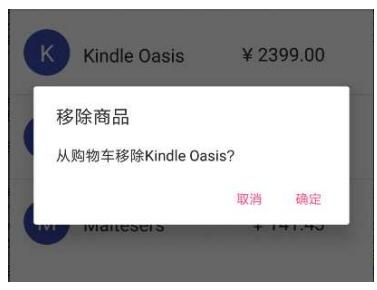

<!-- TOC -->

- [Lab 3 - 实现模拟商品列表](#lab-3---实现模拟商品列表)
    - [实验目的](#实验目的)
    - [实验内容](#实验内容)
    - [实现要求](#实现要求)
        - [布局方面](#布局方面)
        - [逻辑方面](#逻辑方面)
    - [实验过程](#实验过程)
        - [实验步骤](#实验步骤)
            - [step1:去除界面标题栏](#step1去除界面标题栏)
                - [实现效果](#实现效果)
            - [step2:实现商品列表](#step2实现商品列表)
            - [添加依赖](#添加依赖)
            - [RecyclerView介绍](#recyclerview介绍)
            - [实现](#实现)
        - [遇到的问题以及解决方案](#遇到的问题以及解决方案)
    - [参考资料](#参考资料)
        - [关乎实验内容的](#关乎实验内容的)
        - [无关乎实验内容的](#无关乎实验内容的)

<!-- /TOC -->

# Lab 3 - 实现模拟商品列表

## 实验目的

- 1.复习事件处理
- 2.学习Intent、Bundle在Activity跳转中的应用
- 3.学习RecyclerView、ListView以各类适配器的用法

## 实验内容

本次实验模拟实现一些商品表，有两个界面，第一个界面用于呈现商品（如下左图，为长截屏），点击右下方的悬浮的按钮可切换到购物车（如下中图）；点击第一个界面中的列表的任一项，可看到商品的详细信息（如下右图）。


## 实现要求

### 布局方面

- [x] 1.商品列表界面
    - [x] 每一项为一个圆圈和一个名字，圆圈与名字均竖直居中。
    - [x] 圆圈中为名字的首字母，首字母要处于圆圈的中心，首字母为白色，名字为黑色，圆圈的颜色可自定义（尽量选择深色）。
- 2.购物车列表界面
    - 在商品表界面的基础上增加一个价格，价格为黑色。
- [x] 3.商品详情界面
    - 顶部
        - [x] 顶部占整个界面的1/3。
        - [x] 每个商品的图片在商品数据中已给出，图片与当前view等高。
        - [x] 返回图标（即是“<”）处于当前view左上角。
        - [x] 商品名字处于左下角。
        - [x] 返回图标与商品名字左对齐。
        - [x] 星标位于右下角。
        - [x] 商品名字和星标底边对齐。
        - [x] 返回图标、商品、星标与边距都有一定距离，自己调出合适的距离即可。
        - [x] 该部分推荐用RelativeLayout实现。
    - 中部
        - [x] 黑色字体（比如价格和“更多产品信息”）的argb编码值为#D5000000，字体大小可自行调节，和给出的例子差不多就好了
        - [x] 价格下面的偏灰色的字体的argb编码值为#8A000000。
        - [x] 价格下面的分割线和购物车图标左侧的分割线的argb编码值为#1E000000。
        - [x] 购物车图标左侧分割线要求高度与购物车图像高度一致，并且竖直居中。
        - [x] “更多产品信息”底部的分隔区域高度也可自行调节，argb编码值为#1E000000。
    - 底部
        - [x] 按图照葫芦画瓢即可。
- [x] 4.【特别提醒】
    - [x] 这次的界面顶部都没有标题栏，需要用某些方法把它们去掉。

### 逻辑方面

- 1.商品列表界面
    - [x] 使用RecyclerView实现商品列表。
    - [x] 点击商品列表中的某一个商品会跳转到该商品详情界面。
    - [x] 长按商品列表中的第i个商品会删除该商品，并且弹出Toast提示“移除第i个商品”。（i从0开始）
- 2.点击右下方的FloatingActionButton，从商品列表切换到购物车或从购物车切换到商品列表，并且其里面的图标要做相应的变化。
    - 可通过设置RecyclerView不可见+ListView可见来实现从商品列表切换到购物车。
    - 可通过设置RecyclerView可见+ListView不可见来实现从购物车切换到商品列表。
- 3.购物车界面
    - 使用ListView实现
    - 点击购物车的某一个商品会跳转到商品详情界面。
    - 长按购物列表中的xxx商品会弹出对话框询问“从购物车移除xxx？”，点击确定则移除，点击取消则对话框消失。(xxx为该商品名字)

    

- 4.商品详情界面
    - [x] 点击返回图标会返回上一层。
    - [x] 点击星标会切换状态。
        -  若原来是空心星星，则变成实心星星。
        -  若原来是实心星星，则变成空心星星。
    - 点击购物车图标会将该商品添加到购物车并弹出Toast提示“商品已添加到购物车”
        - 不要求判断购物车已否已有该商品，即多次点击购物车图标可以只添加一件商品，也可添加多件商品。
    - [x] 底部的四个操作的列表用ListView实现

## 实验过程


### 实验步骤

#### step1:去除界面标题栏

找到res文件夹下的styles.xml，将：

```xml
<style name="AppTheme" parent="Theme.AppCompat.Light.DarkActionBar">
```

修改为：

```xml
<style name="AppTheme" parent="Theme.AppCompat.Light.NoActionBar">
```

##### 实现效果

修改代码前（左图）和修改代码后（右图）视图比较：


可见标题栏已成功去除。

#### step2:实现商品列表

#### 添加依赖

商品列表要求用RecyclerView实现，因此需要在Grade Scripts\build.gradle(Module:app)中的dependencies添加`compile 'com.android.support:recyclerview-v7:25.3.1'`。

同时，由于后续还要用到RecyclerView中的动画效果，因此还需添加如下两条配置：

```c++
compile 'jp.wasabeef:recyclerview-animators:2.2.2'
compile 'com.android.support:support-core-utils:25.3.1'
```


#### RecyclerView介绍

RecyclerView与ListView原理是类似的：都是仅仅维护少量的View并且可以展示大量的数据集。RecyclerView用以下两种方式简化了数据的展示和处理:

- 使用LayoutManager来确定每一个item的排列方式。
- 为增加和删除项目提供默认的动画效果。

RecyclerView项目结构如下：


- Adapter：使用RecyclerView之前，其需要一个继承自RecyclerView.Adapter的适配器，作用是将数据与每一个item的界面进行绑定。
- LayoutManager：用来确定每一个item如何进行排列摆放，何时展示和隐藏。回收或重用一个View的时候，LayoutManager会向适配器请求新的数据来替换旧的数据，这种机制避免了创建过多的View和频繁的调用findViewById方法（与ListView原理类似）。

#### 实现


### 遇到的问题以及解决方案

- Java错误提示is not an enclosing class:
    - 解决方案：http://blog.csdn.net/zhouzme/article/details/20840439
- xml中TextView引用已定义好的样式时出错：android.view.InflateException: Binary XML file line #14: Error inflating class
    - 解决方案：https://www.crifan.com/android_textview_android_view_inflateexception_binary_xml_file_line_error_inflating_class_unknown/


## 参考资料

### 关乎实验内容的

- [RecyclerView使用介绍][4]
- [Github@wasabeef---recyclerview-animators][5]
- [Android RelativeLayout属性][7]
- [在xml和代码中设置ImageView图片的显示比例][8]
- [Android中为控件之间添加分割线][10]
- [Android相对布局(RelativeLayout)][11]
- [android使用Intent传递数据 2 种方式(Intent和Bundle)][12]
- [返回上一层activity的实现方式(拓展：不同activity间的任意跳转)][13]

### 无关乎实验内容的

- [android-studio-keeps-replacing-match-parent-with-fixed-dp-value][9]
- [自定义TextView字体step1: Android中通过typeface设置字体][1]
- [自定义TextView字体step2: Android Studio中新建和引用assets文件][2]
- [AndroidStudio设置创建文件开始时注释内容][3]
- [为什么用ConstraintLayout代替其他布局?][6]


[1]:http://www.cnblogs.com/bravestarrhu/archive/2012/07/17/2595598.html
[2]:http://blog.csdn.net/u011710991/article/details/52219648
[3]:http://jingyan.baidu.com/article/ff411625c6150912e48237a8.html
[4]:http://www.jcodecraeer.com/a/anzhuokaifa/androidkaifa/2014/1118/2004.html
[5]:https://github.com/wasabeef/recyclerview-animators
[6]:http://www.jianshu.com/p/32a0a6e0a98a
[7]:http://www.cnblogs.com/sevenyuan/archive/2010/09/16/1827940.html
[8]:http://blog.csdn.net/lixue9185/article/details/52037031
[9]:https://stackoverflow.com/questions/43452384/android-studio-keeps-replacing-match-parent-with-fixed-dp-value
[10]:http://blog.csdn.net/u012738773/article/details/50974175
[11]:http://blog.csdn.net/loongembedded/article/details/35569043
[12]:http://blog.csdn.net/neu_yousei/article/details/21953995
[13]:http://blog.csdn.net/dsa63/article/details/17010887
