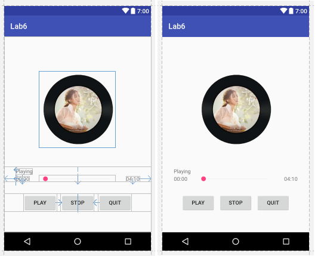
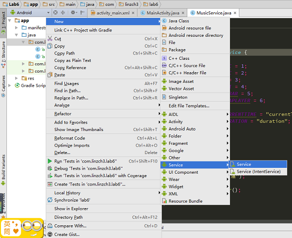
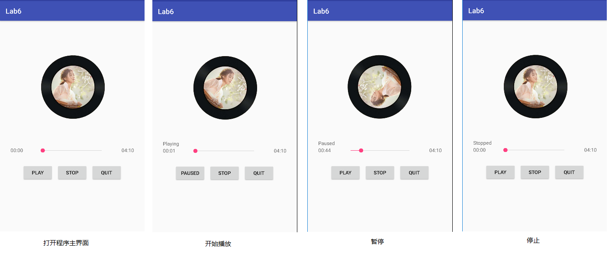

- [Lab 6 - 服务与多线程--简单音乐播放器](#lab-6---%E6%9C%8D%E5%8A%A1%E4%B8%8E%E5%A4%9A%E7%BA%BF%E7%A8%8B--%E7%AE%80%E5%8D%95%E9%9F%B3%E4%B9%90%E6%92%AD%E6%94%BE%E5%99%A8)
    - [实验目的](#%E5%AE%9E%E9%AA%8C%E7%9B%AE%E7%9A%84)
    - [实验内容](#%E5%AE%9E%E9%AA%8C%E5%86%85%E5%AE%B9)
    - [实验过程](#%E5%AE%9E%E9%AA%8C%E8%BF%87%E7%A8%8B)
        - [step 0: 实验思路](#step-0-%E5%AE%9E%E9%AA%8C%E6%80%9D%E8%B7%AF)
        - [step 1: 界面显示实现及相关初始化操作](#step-1-%E7%95%8C%E9%9D%A2%E6%98%BE%E7%A4%BA%E5%AE%9E%E7%8E%B0%E5%8F%8A%E7%9B%B8%E5%85%B3%E5%88%9D%E5%A7%8B%E5%8C%96%E6%93%8D%E4%BD%9C)
            - [实现效果](#%E5%AE%9E%E7%8E%B0%E6%95%88%E6%9E%9C)
        - [step 2: 图片旋转动画实现](#step-2-%E5%9B%BE%E7%89%87%E6%97%8B%E8%BD%AC%E5%8A%A8%E7%94%BB%E5%AE%9E%E7%8E%B0)
        - [step 3: MusicService类实现](#step-3-musicservice%E7%B1%BB%E5%AE%9E%E7%8E%B0)
        - [step 4: 实现动态获取文件读取权限](#step-4-%E5%AE%9E%E7%8E%B0%E5%8A%A8%E6%80%81%E8%8E%B7%E5%8F%96%E6%96%87%E4%BB%B6%E8%AF%BB%E5%8F%96%E6%9D%83%E9%99%90)
        - [step 5: 开启并连接后台服务](#step-5-%E5%BC%80%E5%90%AF%E5%B9%B6%E8%BF%9E%E6%8E%A5%E5%90%8E%E5%8F%B0%E6%9C%8D%E5%8A%A1)
        - [step 6: 多线程更新UI](#step-6-%E5%A4%9A%E7%BA%BF%E7%A8%8B%E6%9B%B4%E6%96%B0ui)
        - [step 7: 按钮监听事件处理](#step-7-%E6%8C%89%E9%92%AE%E7%9B%91%E5%90%AC%E4%BA%8B%E4%BB%B6%E5%A4%84%E7%90%86)
            - [播放/暂停按钮](#%E6%92%AD%E6%94%BE%E6%9A%82%E5%81%9C%E6%8C%89%E9%92%AE)
            - [停止按钮](#%E5%81%9C%E6%AD%A2%E6%8C%89%E9%92%AE)
            - [退出按钮](#%E9%80%80%E5%87%BA%E6%8C%89%E9%92%AE)
        - [step 8: 进度条拖动监听事件处理](#step-8-%E8%BF%9B%E5%BA%A6%E6%9D%A1%E6%8B%96%E5%8A%A8%E7%9B%91%E5%90%AC%E4%BA%8B%E4%BB%B6%E5%A4%84%E7%90%86)
    - [最终实现效果](#%E6%9C%80%E7%BB%88%E5%AE%9E%E7%8E%B0%E6%95%88%E6%9E%9C)
    - [遇到的问题及解决方案](#%E9%81%87%E5%88%B0%E7%9A%84%E9%97%AE%E9%A2%98%E5%8F%8A%E8%A7%A3%E5%86%B3%E6%96%B9%E6%A1%88)
    - [参考资料](#%E5%8F%82%E8%80%83%E8%B5%84%E6%96%99)

# Lab 6 - 服务与多线程--简单音乐播放器

## 实验目的

- 1.学会使用 MediaPlayer；
- 2.学会简单的多线程编程，使用 Handle 更新 UI；
- 3.学会使用 Service 进行后台工作；
- 4.学会使用 Service 与 Activity 进行通信。

## 实验内容

实现一个简单的播放器，要求功能有：

- 1.播放、暂停、停止、退出功能；
- 2.后台播放功能；
- 3.进度条显示播放进度、拖动进度条改变进度功能；
- 4.播放时图片旋转，显示当前播放时间功能；


## 实验过程

### step 0: 实验思路

首先来理清下实现的思路。从实验要求来看，不难看出，需要实现两个类，一个是用于展示播放器页面的Activity类MainActivity，一个是用于播放音乐的后台服务类MusicService。

首先来划清MusicService具体该做些什么。MusicService是用来播放音乐的，因此便需要完成如下任务：

- 当播放器页面的PLAY(PAUSED)、STOP被点击时需要完成音乐的播放(暂停)、停止功能以及释放与音乐服务相关资源的功能。
- 在播放的过程中，需要不断地把音乐的进度数据发送到MainActivity。
- 当用于拖动进度条并释放时，需要将音乐的播放进度也跳转到相应位置。

而MainActivity则需要完成如下任务：

- 由于MusicService需要读取SD卡的音乐文件，因此需在MainActivity中先获取读取SD卡数据的权限。
- 开启并绑定音乐服务。
- 通过多线程更新UI（包括音乐的进度条更新、已播放时间更新等等）。
- 实现点击PLAY、STOP、QUIT按钮的点击事件的触发响应。
- 实现音乐进度条的拖动事件的触发响应。

除此之外，服务与Activity之间的通信使用IBinder来进行：

- 服务发送数据到Activity：重写`IBinder.onTransact()`函数实现
- Activity发送数据到服务：调用`IBinder.transact()`函数实现

### step 1: 界面显示实现及相关初始化操作

实现的第一步自然是要实现界面UI的显示啦，在MainActivity对应的布局文件的activity_main.xml中添加如下代码：

```xml
<?xml version="1.0" encoding="utf-8"?>
<android.support.constraint.ConstraintLayout xmlns:android="http://schemas.android.com/apk/res/android"
    xmlns:app="http://schemas.android.com/apk/res-auto"
    xmlns:tools="http://schemas.android.com/tools"
    android:layout_width="match_parent"
    android:layout_height="match_parent"
    tools:context="com.linzch3.lab6.MainActivity">

    <ImageView
        android:id="@+id/music_image"
        android:layout_width="200dp"
        android:layout_height="200dp"
        android:src="@drawable/image"
        app:layout_constraintLeft_toLeftOf="parent"
        app:layout_constraintRight_toRightOf="parent"
        app:layout_constraintTop_toTopOf="parent"
        android:layout_marginTop="90dp"/>

    <RelativeLayout
        android:id="@+id/progress_layout"
        android:layout_width="0dp"
        android:layout_height="40dp"
        app:layout_constraintLeft_toLeftOf="parent"
        app:layout_constraintRight_toRightOf="parent"
        app:layout_constraintTop_toBottomOf="@+id/music_image"
        android:layout_marginTop="50dp">

        <TextView
            android:id="@+id/current_progress"
            android:layout_width="wrap_content"
            android:layout_height="wrap_content"
            android:text="00:00"
            android:layout_alignParentLeft="true"
            android:layout_marginLeft="30dp"
            android:layout_alignParentBottom="true"
            />

        <TextView
            android:id="@+id/current_status"
            android:layout_width="wrap_content"
            android:layout_height="wrap_content"
            android:text="Playing"
            android:layout_alignLeft="@id/current_progress"
            android:layout_alignBottom="@id/current_progress"
            android:layout_marginBottom="20dp"/>

        <SeekBar
            android:id="@+id/seekbar"
            android:layout_width="200dp"
            android:layout_height="wrap_content"
            android:layout_centerHorizontal="true"
            android:layout_alignParentBottom="true"/>

        <TextView
            android:id="@+id/max_progress"
            android:layout_width="wrap_content"
            android:layout_height="wrap_content"
            android:text="04:10"
            android:layout_alignParentRight="true"
            android:layout_marginRight="30dp"
            android:layout_alignParentBottom="true"/>

    </RelativeLayout>

    <RelativeLayout
        android:id="@+id/button_layout"
        android:layout_width="0dp"
        android:layout_height="wrap_content"
        app:layout_constraintLeft_toLeftOf="parent"
        app:layout_constraintRight_toRightOf="parent"
        app:layout_constraintTop_toBottomOf="@+id/progress_layout"
        android:layout_marginTop="30dp">

        <Button
            android:id="@+id/stop_button"
            android:layout_width="wrap_content"
            android:layout_height="wrap_content"
            android:text="STOP"
            android:layout_centerHorizontal="true"/>

        <Button
            android:id="@+id/play_button"
            android:layout_width="wrap_content"
            android:layout_height="wrap_content"
            android:text="PLAY"
            android:layout_toLeftOf="@id/stop_button"
            android:layout_marginRight="10dp"/>

        <Button
            android:id="@+id/quit_button"
            android:layout_width="wrap_content"
            android:layout_height="wrap_content"
            android:text="QUIT"
            android:layout_toRightOf="@id/stop_button"
            android:layout_marginLeft="10dp"/>

    </RelativeLayout>

</android.support.constraint.ConstraintLayout>
```

这里用SeekBar控件来实现音乐的进度条显示；进度条相关部分和三个按钮都使用RelativeLayout实现，总体布局使用ConstraintLayout实现。

接着在MainActivity中声明如下变量：

```java
private Button playButton;
private Button stopButton;
private Button quitButton;
private TextView currentProgress;
private TextView duration;
private TextView musicStatus;
private ImageView musicImage;
private SeekBar seekBar;
```

并在`onCreate()`函数中进行如下的初始化操作：

```java
playButton = (Button)findViewById(R.id.play_button);
stopButton = (Button)findViewById(R.id.stop_button);
quitButton = (Button)findViewById(R.id.quit_button);
currentProgress = (TextView)findViewById(R.id.current_progress);
duration = (TextView)findViewById(R.id.max_progress);
musicStatus = (TextView)findViewById(R.id.current_status);
musicStatus.setText(STATUS_DEFAULT);
musicImage = (ImageView)findViewById(R.id.music_image);
seekBar = (SeekBar)findViewById(R.id.seekbar);
```

注意这里通过`musicStatus.setText(STATUS_DEFAULT);`将音乐状态显示的TextView控件中的文字在初始化时设置为默认，关于音乐状态的各种取值在MainActivity中定义如下：

```java
public final static String STATUS_DEFAULT = "";
public final static String STATUS_PLAYING = "Playing";
public final static String STATUS_PAUSED = "Paused";
public final static String STATUS_STOPPED = "Stopped";
```

#### 实现效果

预览效果如下：



这里用到一个trick，若想在ConstraintLayout中让一个元素居中显示，可以选择如下配置方式：

```r
android:layout_width="0dp"
app:layout_constraintLeft_toLeftOf="parent"
app:layout_constraintRight_toRightOf="parent"
```

而若想在RelativeLayout中让一个元素居中显示，便可选择如下配置方式：

```r
android:layout_centerHorizontal="true"
```

### step 2: 图片旋转动画实现

图片的旋转动画由`ObjectAnimator`实现。

首先在MainActivity中声明如下变量：

```java
private ObjectAnimator mMusicImageAnimator;
```

接着在`onCreate()`函数中进行动画的配置：

```java
mMusicImageAnimator = ObjectAnimator.ofFloat(musicImage, "rotation", 0, 360);//0到360旋转
mMusicImageAnimator.setInterpolator(new LinearInterpolator());//线性变化
mMusicImageAnimator.setRepeatCount(ValueAnimator.INFINITE);//无穷次重复
mMusicImageAnimator.setRepeatMode(ValueAnimator.RESTART);//每个周期结束后从头开始
mMusicImageAnimator.setDuration(12000);//单个周期的时间(ms)
```

随后只要调用`mMusicImageAnimator.start()`就可以使动画开始播放啦。

### step 3: MusicService类实现

首先，右键MainActivity所在文件夹，使用如下方式创建给类：



接着添加如下代码：

```java
private IBinder mBinder;
private MediaPlayer mMediaPlayer;

@Override
public void onCreate() {
    super.onCreate();
    Log.e("debug", "MusicService创建");
    /*初始化*/
    mMediaPlayer = new MediaPlayer();
    mBinder = new MusicBinder();
    /*初始化*/
}

@Override
public IBinder onBind(Intent intent) {
    return mBinder;
}
```

这里先是声明了两个类变量，其中mBinder是用于与MainActivity通信的IBinder；mMediaPlayer是用于管理音乐播放相关的MediaPlayer。接着重写`onCreate()`函数来实现mBinder和mMediaPlayer的初始化，其中MusicBinder是Binder类的子类，后续会实现。最后重写了`onBind()`函数，该函数在该服务被绑定时会调用，其直接返回此处所创建的mBinder。

接着实现MusicBinder类，该类便负责了Activity与服务的通信任务。

首先，先在MusicService类中定义如下变量：

```java
/*MediaPlyaer相关*/
public final static int PLAY_MUSIC = 1;
public final static int STOP_MUSIC = 2;
public final static int QUIT_APP = 3;
public final static int REFRESH_UI = 4;
public final static int DRAG_SEEKBAR = 5;
public final static int INIT_MEDIAPLAYER = 6;
/*Bundle发送数据相关*/
public final static String KEY_CURRENTTIME = "currentTime";
public final static String KEY_DURATION = "duration";
```

接着实现MusicBinder类，该类通过重写`onTransact()`函数来实现具体的通信操作。

`onTransact(int code, Parcel data, Parcel reply, int flags)`函数中的变量含义依次为：

- `code`：区分不同时间的代号（或代码）
- `data`：保存从Activity传到服务的数据
- `reply`：保存从服务传到Activity的数据
- `flags`：标记变量，这里没用到

类实现如下：

```java
public class MusicBinder extends Binder{
    @Override
    protected boolean onTransact(int code, Parcel data, Parcel reply, int flags) throws RemoteException {
        switch (code)
        {
            case PLAY_MUSIC:
                /*播放音乐*/
                if(mMediaPlayer!=null){
                    if(mMediaPlayer.isPlaying()){
                        mMediaPlayer.pause();
                    }else{
                        mMediaPlayer.start();
                    }
                }
                break;
            case STOP_MUSIC:
                /*停止音乐*/
                /*代码应这样写才可以在下次播放时重新开始播放 */
                if(mMediaPlayer!=null){
                    mMediaPlayer.stop();
                    try {
                        mMediaPlayer.prepare();
                        mMediaPlayer.seekTo(0);
                    } catch (IOException e) {
                        e.printStackTrace();
                    }
                }
                break;
            case QUIT_APP:
                /*退出应用*/
                if(mMediaPlayer!=null){
                    mMediaPlayer.reset();
                    mMediaPlayer.release();
                }
                break;
            case REFRESH_UI:
                /*更新UI界面*/
                if(mMediaPlayer!=null){
                    Bundle replayData = new Bundle();
                    try {
                        replayData.putInt(KEY_CURRENTTIME, mMediaPlayer.getCurrentPosition());
                        replayData.putInt(KEY_DURATION, mMediaPlayer.getDuration());
                        reply.writeBundle(replayData);
                    }catch (Exception e){
                        e.printStackTrace();
                    }
                }
                break;
            case DRAG_SEEKBAR:
                /*拖动进度条*/
                if(mMediaPlayer!=null){
                    int currentPosition = data.readInt();
                    mMediaPlayer.seekTo(currentPosition);
                }
                break;
            case INIT_MEDIAPLAYER:
                /*初始化MediapPlyaer*/
                try {
                    String filePath = Environment.getExternalStorageDirectory()+"/melt.mp3";
                    mMediaPlayer.setDataSource(filePath);
                    Log.e("debug", "音乐文件路径："+filePath);
                    mMediaPlayer.prepare();
                    mMediaPlayer.setLooping(true);
                    Log.e("debug", "初始化mediaplayer成功");
                } catch (IOException e) {
                    e.printStackTrace();
                }
                break;
            default:
                Log.e("debug", "in MusicBinder onTransact() 未定义switch case条件分支："+code);
                break;
        }
        return super.onTransact(code, data, reply, flags);
    }
}
```

该部分的实现逻辑涉及到MediaPlayer的各种状态切换，如果不了解各种状态切换的状态图，写出来的代码可能会报IllegalStateException异常。相关资料可看参考资料2。

在`case INIT_MEDIAPLAYER`中，程序读取了`Environment.getExternalStorageDirectory()+"/melt.mp3"`路径下的音乐文件，其中`Environment.getExternalStorageDirectory()`即为手机内存存储的根目录，这里事先已经将音乐文件放置在了该目录下了。

至此，MusicService类实现完毕。

### step 4: 实现动态获取文件读取权限

前面提到，MusicService类需要读取手机内置SD卡根目录下的`melt.mp3`文件，因此需要先申请读取文件的权限，该部分操作在MainActivity中实现。

首先在类中声明如下变量：

```java
private static boolean SdcardReadable = false;//标记当前SD卡是否可读
```

接着实现如下的权限确认函数：

```java
public void verifyStoragePermissions(Activity activity)
{
    try {
        if (ActivityCompat.checkSelfPermission(activity, "android.permission.READ_EXTERNAL_STORAGE") != 0)
        {
            Log.e("debug", "此处应弹出提示框");
            ActivityCompat.requestPermissions(activity,
                    new String[]{"android.permission.READ_EXTERNAL_STORAGE"}, 1);
        }else
        {
            Log.e("debug", "成功获取权限 in verifyStoragePermissions()");
            SdcardReadable = true;/******标记已获取权限****/
        }
    }
    catch (Exception localException)
    {
        localException.printStackTrace();
    }
}
```

当程序没有获取权限时，系统会弹出询问框，用户选择后，系统会调用如下回调函数：

```java
@Override
public void onRequestPermissionsResult(int requestCode, @NonNull String[] permissions, @NonNull int[] grantResults) {
    super.onRequestPermissionsResult(requestCode, permissions, grantResults);
    switch (requestCode)
    {
        case 1:
            Log.e("debug", "系统回调，尝试获取权限");
            if(grantResults.length>0 && grantResults[0] == PackageManager.PERMISSION_GRANTED){
                /*若用户同意app获取权限，标记可读取文件*/
                Log.e("debug", "成功获取权限 in onRequestPermissionsResult()");
                SdcardReadable = true;/******标记已获取权限****/
            }else{
                /*若用户拒绝app获取权限，则弹出信息提示“拒绝权限将无法使用本程序”*/
                Toast.makeText(this, "拒绝权限将无法使用本程序", Toast.LENGTH_SHORT).show();
                finish();
            }
            break;
        default:
            Log.e("debug", "undefined requestCode:"+requestCode);
            break;
    }
}
```

这里需要注意：有的手机（比如我的魅族手机，Android 5.1）安装完app后，**默认已拥有了读取SD卡的权限**。因此此时`onRequestPermissionsResult()`函数并不会调用。而在Android 6.0的机型上便需要弹出询问框申请权限，此时`onRequestPermissionsResult()`函数才会调用。

接着在`onCreate()`函数中调用`verifyStoragePermissions()`函数：

```java
@Override
protected void onCreate(Bundle savedInstanceState) {
    super.onCreate(savedInstanceState);
    setContentView(R.layout.activity_main);

    /*********在最前面添加这段代码*********/
    verifyStoragePermissions(this);
    /*********在最前面添加这段代码*********/

    //其他代码
}
```

### step 5: 开启并连接后台服务

首先在MainActivity中声明如下变量：

```java
private IBinder mMusicBinder;
private ServiceConnection mMusicServiceConnection;
```

这里的mMusicBinder便是MainActivity与后台服务相互通信的媒介，mMusicServiceConnection是用来连接服务的。

接着在`onCrete()`函数添加如下代码：

```java
mMusicServiceConnection = new ServiceConnection() {
    @Override
    public void onServiceConnected(ComponentName name, IBinder service) {
        mMusicBinder = service;
        /*当SD卡可读且未初始化过播放器时，初始化播发器*/
        if(SdcardReadable && !initMeidaPlayerSuccessed[0])
        {
            initMediaPlayer();
            initMeidaPlayerSuccessed[0] = true;
        }
        Log.e("debug", "服务连接成功");
    }

    @Override
    public void onServiceDisconnected(ComponentName name) {
        mMusicBinder = null;
        Log.e("debug", "服务意外断开！（客户端解除绑定服务时，该方法不会被调用）");
    }
};
Intent bindIntent = new Intent(this, MusicService.class);
startService(bindIntent);//开启服务
bindService(bindIntent, mMusicServiceConnection, BIND_AUTO_CREATE);//绑定服务
```

这里通过`startService()`函数来开启服务并通过`bindService()`函数来绑定函数。其中，当服务绑定成功时`mMusicServiceConnection`的`onServiceConnected`函数会被调用（在此期中，服务的`onBind()`函数也会被调用），因此可以在`onServiceConnected`函数给mMusicBinder初始化，并在此处调用`initMediaPlayer()`函数初始化播放器。

其中，`initMediaPlayer()`函数实现如下，其通过mMusicBinder调用`transact()`函数来发送初始化播放器的信息到后台服务中。

```java
void initMediaPlayer()
{
    /*初始化MediaPlayer*/
    Parcel inputData = Parcel.obtain();
    Parcel expectedReply = Parcel.obtain();
    try {
        mMusicBinder.transact(MusicService.INIT_MEDIAPLAYER, inputData, expectedReply, 0);
    } catch (RemoteException e) {
        e.printStackTrace();
    }
}
```

而`onServiceConnected()`函数中的`initMeidaPlayerSuccessed[0]`是用于**标记是否已成功初始化播发器**的布尔变量，其在MainActivity声明如下，**该变量在后续更新UI时会用到**。

```java
final boolean[] initMeidaPlayerSuccessed = {false};
```

### step 6: 多线程更新UI

当音乐正在后台播放时，播放器界面的进度条和播放时间均需要实时地进行更新，而MainActivity的主线程显然需要处理如按钮触发事件的监听等任务，所以不能直接在主线程中编码实现更新UI的代码。但由于Android的UI是线程不安全的，也即是说如果想要更新UI，则必须在主线程中进行，否则会出现异常。

因此，解决方案如下：

首先在MainActivity(主线程)中声明如下变量：

```java
public final static int UPDATE_UI = 1;
private Handler mUiUpdateHandler;
```

接着在`onCrete()`函数添加如下代码：

```java
mUiUpdateHandler = new Handler(){
    @Override
    public void handleMessage(Message msg) {
        super.handleMessage(msg);
        switch (msg.what)
        {
            case UPDATE_UI:
                /*更新UI*/
                SimpleDateFormat timeFormat = new SimpleDateFormat("mm:ss");//设置音乐时间的格式
                Parcel inputData = Parcel.obtain();
                Parcel expectedReply = Parcel.obtain();
                try {
                    mMusicBinder.transact(MusicService.REFRESH_UI, inputData, expectedReply, 0);
                    Bundle replyData = expectedReply.readBundle();
                    /*更新播放时间的最大值*/
                    if(replyData.containsKey(MusicService.KEY_DURATION))
                    {
                        duration.setText(timeFormat.format(Integer.valueOf(replyData.getInt(MusicService.KEY_DURATION))));
                        seekBar.setMax(replyData.getInt(MusicService.KEY_DURATION));
                    }
                    /*更新当前已播放时间*/
                    if(replyData.containsKey(MusicService.KEY_CURRENTTIME)){
                        currentProgress.setText(timeFormat.format(Integer.valueOf(replyData.getInt(MusicService.KEY_CURRENTTIME))));
                        seekBar.setProgress(replyData.getInt(MusicService.KEY_CURRENTTIME));
                    }
                } catch (RemoteException e) {
                    e.printStackTrace();
                }
                break;
            default:
                Log.e("debug", "in handleMessage() 未定义switch case条件分支："+msg.what);
                break;
        }
    }
};
```

此时mUiUpdateHandler便是主线程内的变量，当其调用`handleMessage()`函数更新UI时便是在主线程进行UI的更新。其在每次UI的更新中，都会更新**播放时间的最大值**以及**当前已播放时间**。

ps：其实播放时间的最大值应该只需要更新一次就好了，但是这样就需要一个标记变量，所以为了避免麻烦就每次都更新了。

接着在`onCrete()`函数实现如下的一个匿名线程，该线程**在服务还处于绑定状态并且已经初始化播放器**的条件下，每100ms便会通过mUiUpdateHandler发送一条标识为`UPDATE_UI`的信息，mUiUpdateHandlers随后便会收到这条信息并执行`handleMessage()`函数。

```java
new Thread(){
    @Override
    public void run() {
        super.run();
        /*每100ms更新一次UI*/
        while (true)
        {
            try {
                Thread.sleep(100);
            } catch (InterruptedException e) {
                e.printStackTrace();
            }
            /*当服务还处于绑定状态并且已经初始化播放器时更新UI*/
            if(mMusicServiceConnection != null && initMeidaPlayerSuccessed[0]){
                mUiUpdateHandler.obtainMessage(UPDATE_UI).sendToTarget();
            }
        }
    }
}.start();
```

### step 7: 按钮监听事件处理

#### 播放/暂停按钮

PLAY按钮被点击时需要处理的任务有：

- 根据当前的音乐状态设置play按钮的文字信息和图片的动画效果
    - 若是默认状态，则状态改变为Playing，play按钮文字改变为PAUSED
    - 若是Playing状态，则状态改变为Pause，play按钮文字改变为PLAY
    - 若是其他状态，则状态改变为Playing，play按钮文字改变为PAUSED
- 发送点击了play按钮的信息到后台服务，以开启或暂停音乐

在`onCrete()`函数添加如下代码：

```java
playButton.setOnClickListener(new View.OnClickListener() {
    @Override
    public void onClick(View v) {
        /*根据当前的音乐状态设置play按钮的文字信息和图片的动画效果*/
        if(musicStatus.getText().equals(STATUS_DEFAULT)){
            /*若是默认状态，则状态改变为Playing，play按钮文字改变为PAUSED*/
            musicStatus.setText(STATUS_PLAYING);
            playButton.setText("PAUSED");
            if(!mMusicImageAnimator.isStarted()){
                mMusicImageAnimator.start();
            }
            else if(mMusicImageAnimator.isPaused()){
                mMusicImageAnimator.resume();
            }else{
                Log.e("debug", "unexpected mMusicImageAnimator state");
            }
        }
        else if(musicStatus.getText().equals(STATUS_PLAYING)){
            /*若是Playing状态，则状态改变为Pause，play按钮文字改变为PLAY*/
            musicStatus.setText(STATUS_PAUSED);
            playButton.setText("PLAY");
            mMusicImageAnimator.pause();
        }else{
            /*若是其他状态，则状态改变为Playing，play按钮文字改变为PAUSED*/
            musicStatus.setText(STATUS_PLAYING);
            playButton.setText("PAUSED");
            if(!mMusicImageAnimator.isStarted()){
                mMusicImageAnimator.start();
            }
            else if(mMusicImageAnimator.isPaused()){
                mMusicImageAnimator.resume();
            }else{
                Log.e("debug", "unexpected mMusicImageAnimator state");
            }
        }
        /*发送点击了play按钮的信息到后台服务*/
        Parcel inputData = Parcel.obtain();
        Parcel expectedReply = Parcel.obtain();
        try {
            mMusicBinder.transact(MusicService.PLAY_MUSIC, inputData, expectedReply, 0);
        } catch (RemoteException e) {
            e.printStackTrace();
        }
    }
});
```

#### 停止按钮

STOP按钮被点击时需要处理的任务有：

- 设置当前状态、并设置图片回归到原始状态
- 发送点击了stop按钮的信息到后台服务，以停止播放音乐

在`onCrete()`函数添加如下代码：

```java
stopButton.setOnClickListener(new View.OnClickListener() {
    @Override
    public void onClick(View v) {
        /*设置当前状态、并设置图片回归到原始状态*/
        musicStatus.setText(STATUS_STOPPED);
        playButton.setText("PLAY");
        mMusicImageAnimator.end();
        /*发送点击了stop按钮的信息到后台服务*/
        Parcel inputData = Parcel.obtain();
        Parcel expectedReply = Parcel.obtain();
        try {
            mMusicBinder.transact(MusicService.STOP_MUSIC, inputData, expectedReply, 0);
        } catch (RemoteException e) {
            e.printStackTrace();
        }
    }
});
```

#### 退出按钮

QUIT按钮被点击时需要处理的任务有：

- 发送点击了quit按钮的信息到后台服务，提示后台服务释放资源
- 取消绑定服务并停止服务
- 关闭当前的Activity以及所有相关的线程
- 
在`onCrete()`函数添加如下代码：

```java
final Intent stopIntent = new Intent(this, MusicService.class);

quitButton.setOnClickListener(new View.OnClickListener() {
    @Override
    public void onClick(View v) {
        /*发送点击了quit按钮的信息到后台服务，提示后台服务释放资源*/
        Parcel inputData = Parcel.obtain();
        Parcel expectedReply = Parcel.obtain();
        try {
            mMusicBinder.transact(MusicService.QUIT_APP, inputData, expectedReply, 0);
        } catch (RemoteException e) {
            e.printStackTrace();
        }
        /*取消绑定服务并停止服务*/
        unbindService(mMusicServiceConnection);
        mMusicServiceConnection = null;
        stopService(stopIntent);
        /*关闭当前的Activity以及所有相关的线程*/
        finish();
        System.exit(0);//关闭所有相关的线程
    }
});
```

### step 8: 进度条拖动监听事件处理

当用户拖动进度条并释放时，需要将音乐的播放进度也跳转到相应位置，因此需要重写`SeekBar.OnSeekBarChangeListener()`类中的`onStopTrackingTouch()`函数，该函数在拖动进度条并释放后会被调用，因此便可在该函数内发送拖动了seekbar的信息到后台服务。

在`onCrete()`函数添加如下代码：

```java
seekBar.setOnSeekBarChangeListener(new SeekBar.OnSeekBarChangeListener() {
        @Override
        public void onProgressChanged(SeekBar seekBar, int progress, boolean fromUser) {

        }

        @Override
        public void onStartTrackingTouch(SeekBar seekBar) {

        }

        @Override
        public void onStopTrackingTouch(SeekBar seekBar) {
            /*发送拖动了seekbar的信息到后台服务*/
            Parcel inputData = Parcel.obtain();
            inputData.writeInt(seekBar.getProgress());
            Parcel expectedReply = Parcel.obtain();
            try {
                mMusicBinder.transact(MusicService.DRAG_SEEKBAR, inputData, expectedReply, 0);
            } catch (RemoteException e) {
                e.printStackTrace();
            }
        }
    });
}
```

至此所有功能实现完毕ヽ(￣▽￣)و

## 最终实现效果

最终实现效果如下图：

- [x] 1.播放、暂停、停止、退出功能；
- [x] 2.后台播放功能；
- [x] 3.进度条显示播放进度、拖动进度条改变进度功能；
- [x] 4.播放时图片旋转，显示当前播放时间功能；



## 遇到的问题及解决方案

- 1.如何在电脑端和手机端上导入文件到手机中。
    - 解决方案：
        - 电脑端：在保证手机已经开启调试模式后可连接电脑时，打开AS->点击Tools->点击Android选项->点击Android Device Monitor。
        - 手机端：下载app——RE文件管理器（操作需要Root权限，做法见下一个问题）。

- 2.想按照TA在实验文档中给出的例子一样，将此次实验的音乐文件放置在真机的`\data`下，但是通过无论是在手机端使用RE文件管理器还是在电脑端使用Android Device Monitor，均因为权限问题无法导入文件到`\data`路径下。
    - 解决方案：先开启手机的Root权限，然后通过RE文件管理器修改`\`路径下`data`文件夹的读写权限。随后便可在电脑端

- 3.如何开启手机的Root权限？
    - 注意事项：**开启Root权限可能会影响手机的保修，所以在进行该操作之前一定要慎重**。（不过好像也有办法可以让Root之后的手机还原到未Root的状态，具体方案就没有去了解）
    - 一般的方法：在电脑端下载**刷机大师**、**kingroot**等软件，通过USB连接手机到电脑，使用软件就可以进行刷机了。
    - 如果上面的方法没有用，可能就得自行百度`root 你的手机品牌`来查找具体方案了。
        - 由于我使用的是meizu手机，使用上面的刷机软件就无法获取Root权限。后来发现魅族高版本的魅族手机系统有开启Root权限的功能（设置->安全->ROOT权限），但是我的魅蓝2的版本太低，没有出现该设置接口，解决方案如下：
            - 在电脑端去官网下载最新的手机系统版本，然后拷贝安装包到手机内置存储卡，然后在手机的文档管理器上点击安装包进行安装，安装后就出现ROOT权限接口了。

- 4.开启手机的ROOT权限之后**找不到手机的开发者选项**？
    - 刚很兴奋地开启ROOT权限，回到设置后发现开发者选项不见了，真是历经波折，百度了之后得到如下的解决方案：
        - 打开设置->关于手机->找到手机的版本号->点击版本号3次就可以开启开发者选项。
        - 随后，回到设置，就可以找到开发者选项的入口了（这个每个手机都不一样）。
        - 更多可参考[这里][1]

- 5.[MediaPlayer播放音乐的时候报错： Should have subtitle controller already set][9]

## 参考资料

1. [Android MediaPlayer各种状态切换][2]
2. [Google:Develop > API Guides > Animation and Graphics][3]
3. [Android动画-属性动画-ObjectAnimator][4]
4. [Handler基本使用（二）new Message 、 Handler.obtainMessage和Message.obtain][5]
5. [Handler sendMessage 与 obtainMessage (sendToTarget)比较][6]
6. [android中常用的finish()与onDestroy()的区别][7]
7. [ObjectAnimator 基本使用][8]
8. [Android里Service的bindService()和startService()混合使用深入分析][10]
9. [android service startService与bindService的区别][11]
10. [android中finish()与system.exit(0)的区别？][12]


[1]:http://bbs.zol.com.cn/softbbs/d21_187366.html
[2]:http://blog.csdn.net/joke124/article/details/51674001
[3]:https://developer.android.com/guide/topics/graphics/prop-animation.html
[4]:http://www.jianshu.com/p/48d79eaf3470
[5]:http://blog.csdn.net/u011791526/article/details/53540346
[6]:http://blog.csdn.net/winson_jason/article/details/8149284
[7]:http://blog.csdn.net/lanxingfeifei/article/details/50662133
[8]:http://wiki.jikexueyuan.com/project/android-animation/7.html
[9]:http://blog.csdn.net/ouyang_peng/article/details/54023240
[10]:http://blog.csdn.net/yuzhiboyi/article/details/7558176
[11]:http://blog.csdn.net/zhuangyalei/article/details/47083279
[12]:http://blog.csdn.net/qq_30498273/article/details/50696204