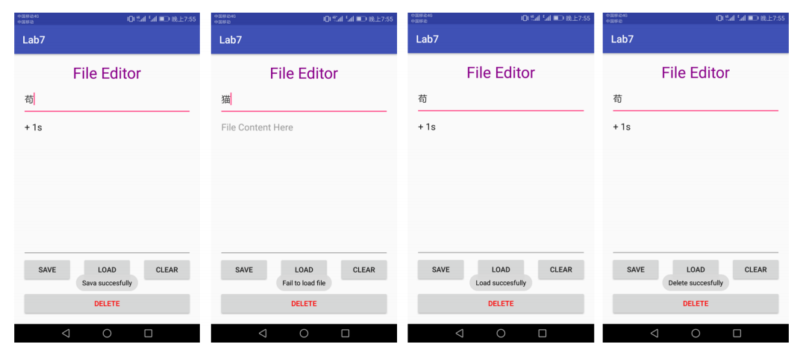

- [Lab 7 - 数据存储（一）](#lab-7---%E6%95%B0%E6%8D%AE%E5%AD%98%E5%82%A8%EF%BC%88%E4%B8%80%EF%BC%89)
    - [实验目的](#%E5%AE%9E%E9%AA%8C%E7%9B%AE%E7%9A%84)
    - [实验内容](#%E5%AE%9E%E9%AA%8C%E5%86%85%E5%AE%B9)

# Lab 7 - 数据存储（一）

## 实验目的

* a、 学习 SharedPreferences 的基本使用；
* b、学习 Android 中常见的文件操作方法；
* c、 复习 Android 界面编程。

## 实验内容

从左至右，依次为：初始密码界面、密码为空提示、密码匹配后重新进入界面、密码错误提示。

从左至右，依次为：保存成功提示、写入失败提示、写入成功提示、删除成功提示。

- 1、 如图所示，本次实验需要实现两个 activity；

- 2、 首先，需要实现一个密码输入 activity：
    - a、 如果应用首次启动，则界面呈现出两个输入框，分别为新密码输入和确认密码输入框；
    - b、输入框下方有两个按钮：
        - OK 按钮，点击之后：
            - 若 new password 为空，则弹出密码为空的提示；
            - 若 new password 与 comfirm password 不匹配，则弹出不匹配的提示；
            - 若密码不为空且互相匹配，则保存密码，进入文件编辑界面。
        - CLEAR 按钮，点击之后清除所有输入框的内容。
    - c、 完成创建密码后，退出应用再进入应用，则只呈现一个密码输入框；
        - 点击 OK 按钮后，如果输入的密码与保存的密码不匹配，则弹出 Toast 提示；
        - 点击 CLEAR 按钮后，清除密码输入框的内容。
    - d、出于学习的目的，我们使用 SharedPreferences 来保存密码，但是在实际应用中我们会用更加安全的机制来保存这些隐私信息，更多可以参考[链接一][1]和[链接二][2]。

- 3、 然后，实现一个文件编辑 activity：
    - a、 界面底部有两行四个按钮，第一行三个按钮高度一致，顶对齐，按钮水平均匀分布。按钮上方除
    了 ActionBar 和 StatusBar 之外的空间由标题和两个 EditText 占据，文件内容编辑的 EditText 需
    要占据除去其他控件的全部屏幕空间，且内部文字竖直方向置顶，左对齐；
    - b、在文件名输入框内输入文件名，在文件内容编辑区域输入任意内容，点击 SAVE 按钮后能够保存
    到指定文件，成功保存后弹出 Toast 提示；
    - c、 点击 CLEAR 按钮，能够清空文件内容编辑区域内的内容；
    - d、点击 LOAD 按钮，能够按照文件名从内存中读取文件内容，并将文件内容写入到编辑框中。如
    果成功导入，则弹出成功的 Toast 提示，如果导入失败（例如：文件不存在），则弹出读取失败
    的 Toast 提示。
    - e、 点击 DELETE 按钮，能够按照文件名从内容中删除文件，删除文件后再载入文件，弹出导入失败
    的 Toast 提示。

- 4、特殊要求：进入文件编辑的 Activity 之后，如果点击返回按钮，则直接返回 Home 界面，不再返回密码输入界面。

[1]:https://stackoverflow.com/questions/1925486/android-storing-username-and-password
[2]:https://stackoverflow.com/questions/785973/what-is-the-most-appropriate-way-to-store-user-settings-in-android-application/786588