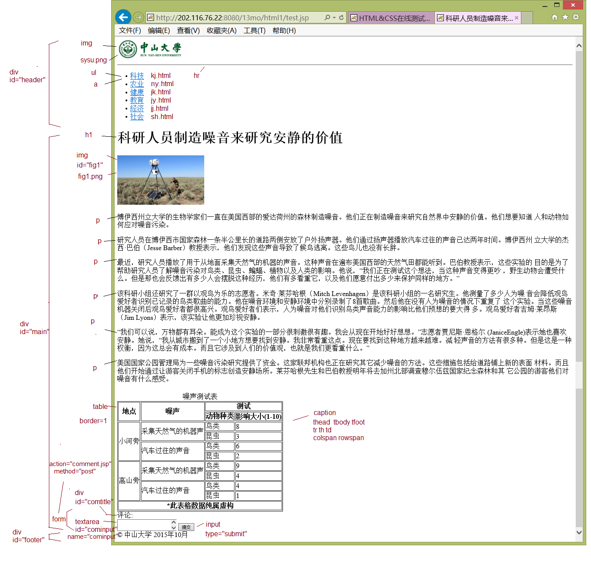
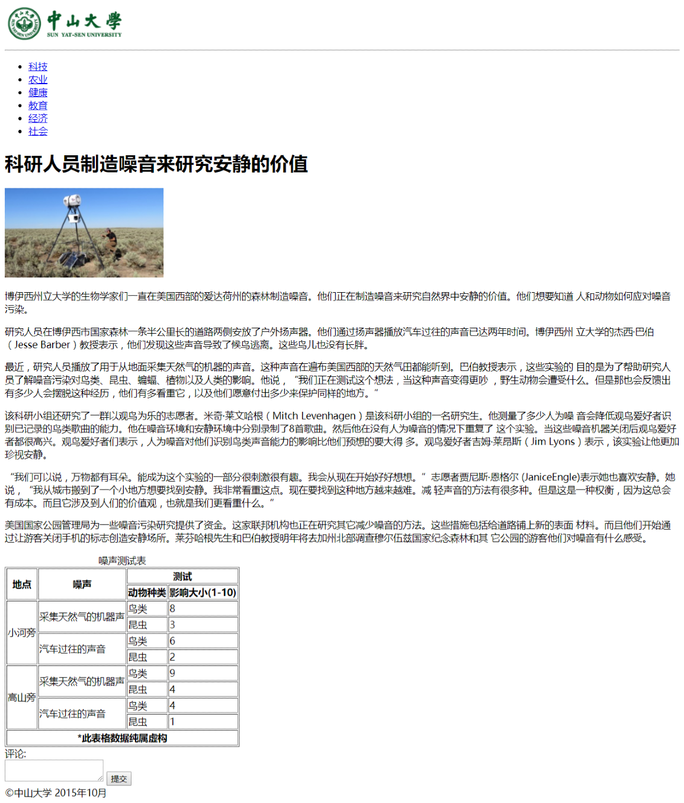
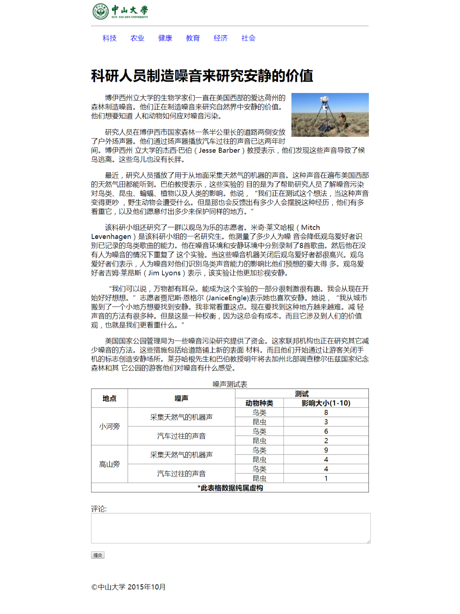
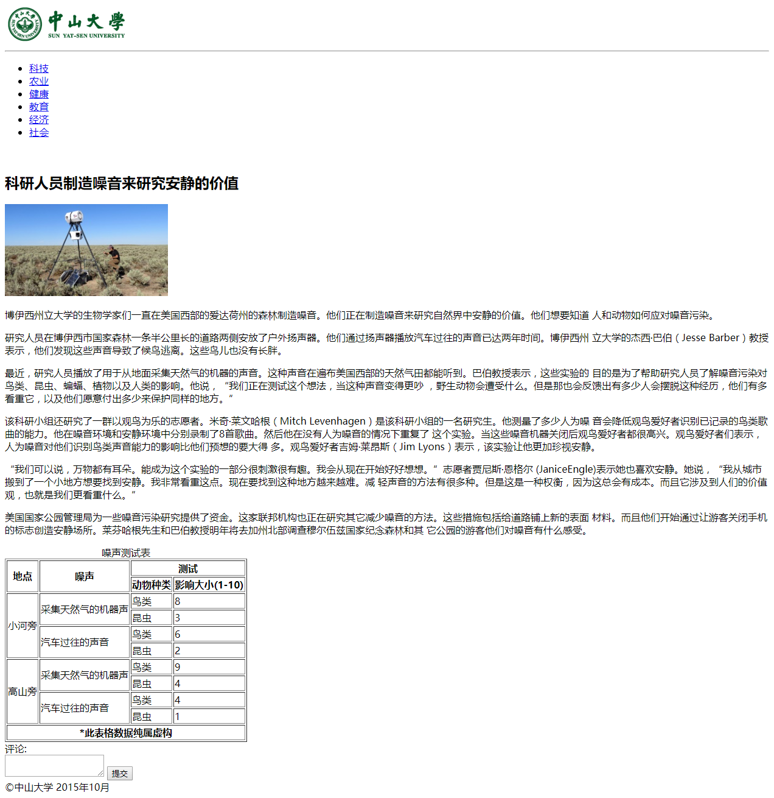
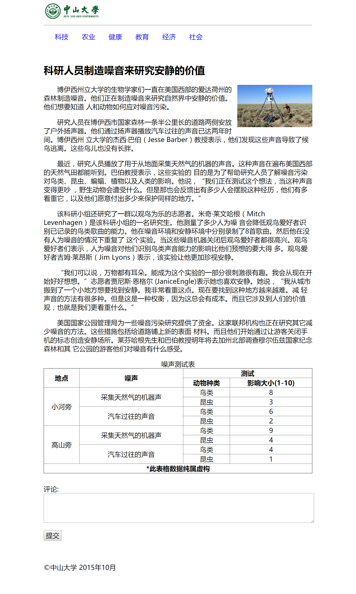

# HTML&CSS实验(1)

## 步骤1

**题目描述**：根据下图提示(标出了元素)尽可能做出相似的网页（文字包含在html1.txt中）。其中包含的图像(sysu.png，fig1.png)和链接的网页(kj.html~sh.html)都在当前路径中；有一些元素下面标出了属性; 最后一行使用了div元素(id="footer")。



实现代码位于<a href="./code/answer/1.html">【这里】</a>，实现效果如下：



## 步骤2

**题目描述**：在步骤1的网页的head元素中加入以下style元素,运行后截屏浏览器。

```html
<style>
    a:link,a:visited {color:blue;text-decoration:none}
    body,inputC {font-size:24px}
    input{margin-top:20px}
    p {text-indent:2em}
    #main,#footer,#header{clear:both;max-width:40em;margin:80px auto}
    #header {margin:0px auto}
    ul li {float:left;list-style-type:none;width:4em;}
    #fig1 {float:right;}
    table {width:100%;border-collapse:collapse}
    td {text-align:center}
    #cominput {width:100%;height:100px}
    #comtitle {margin-top:40px}
</style>
```

实现代码位于<a href="./code/answer/2.html">【这里】</a>，实现效果如下：



## 步骤3

**题目描述**：将步骤1完成的网页中id为"header"、"main"、"footer"的div元素分别换成html5的元素header、article、footer，运行后截屏。

实现代码位于<a href="./code/answer/3.html">【这里】</a>，实现效果如下：



## 步骤4

**题目描述**：把步骤3完成的网页中的head元素中加入以下style元素：

```html
<style>
    a:link,a:visited {color:blue;text-decoration:none}
    body,input,textarea {font-size:24px}
    input{margin-top:20px}
    p {text-indent:2em}
    article,footer,header{clear:both;max-width:40em;margin:80px auto}
    header {margin:0px auto}
    ul li {float:left;list-style-type:none;width:4em;}
    #fig1 {float:right;}
    table {width:100%;border-collapse:collapse}
    td {text-align:center}
    #cominput {width:100%;height:100px}
    #comtitle {margin-top:40px}
</style>
```

实现代码位于<a href="./code/answer/4.html">【这里】</a>，实现效果如下：


